# jev-dojo

日本語 | [English](README.en.md)

**Jev（TypeSafe AI の System One モデル）を、級・段で学ぶハンズオン教材。**
クローンして、APIキーなしで、5分で最初の判定結果を見るところから始めます。

<!-- facts:start -->
```
最終検証: 2026-09-24 ｜ 対象モデル: jev-1.13.0 ｜ SDK: @typesafe-ai/sdk 0.6.0
公式ドキュメント差分チェック: 未実施
```

全サンプルのリクエストを1回ずつ live で送ったときの Jev の費用の目安: 約 $0.0051（入力 121,646 トークン、新規クレジット $5 の 0.10%）。※ 一部は見本データ（合成）のトークン数からの推定。応用B の Claude の費用は別にかかります
<!-- facts:end -->

## 5分で始める

```bash
git clone https://github.com/kenmori/jev-dojo
cd jev-dojo
npm install
npm run demo          # 記録済みの結果を再生。APIキー不要・費用ゼロ
cp .env.example .env  # ここで初めてキーを入れる
npm run k10           # 本物のAPIを叩く
```

ローカルに Node.js を入れたくない場合は「Code → Codespaces」で開けば、そのまま動く環境が立ち上がります。
詰まったら `npm run doctor` で環境を診断できます。

## 級位マップ

```mermaid
flowchart LR
  subgraph 入門["入門（級）"]
    K10["10級<br/>Jevって何？"] --> K9["9級<br/>環境をつくる"] --> K8["8級<br/>最初の1回"] --> K7["7級<br/>Noul"] --> K6["6級<br/>Choice"] --> K5["5級<br/>Score"] --> K4["4級<br/>まとめて聞く"]
  end
  subgraph 中級["中級（段）"]
    D1["初段 state"] --> D2["二段 instructions"] --> D3["三段 confidence"] --> D4["四段 パターン"] --> D5["五段 コードとの境界"]
  end
  subgraph 上級["上級（高段）"]
    D6["六段 評価データ"] --> D7["七段 キャリブレーション"] --> D8["八段 日本語ラボ"] --> D9["九段 本番運用"] --> D10["十段 限界と誤用"]
  end
  subgraph 皆伝["皆伝"]
    O["奥義 仕組み"] --> E["最終試験"]
  end
  K4 --> D1
  D5 --> D6
  D10 --> O
```



全章の一覧は [docs/00-index.md](docs/00-index.md) にあります。

## この教材の特徴

- **段階設計** … どのセクションも、中学生でも読めるやさしい説明から始まり、コードと実行結果へ進み、最後にプロ向けの深掘りを折りたたんで置いています
- **実行コマンドとテストで裏付け** … 全23章のうち21章に実行コマンドがあり、19章に自動テストがあります（内訳は下の「章ごとの動かし方」）。`npm test` は APIキーなしで通ります
- **共通題材を育てる** … 「地域のお祭り掲示板」の投稿を、章ごとに機能を足しながら仕分けていきます
- **古くならない仕組み** … 料金・レート制限・モデルIDは [data/facts.json](data/facts.json) に集め、本文には直接書きません。公式ドキュメントの変化は週次のCIで検出します
- **英語でも進められる** … 英語の本文（[docs/en](docs/en/00-index.md)、[README.en.md](README.en.md)）があり、`.env` に `JEV_LANG=en` と書くとサンプルの質問・投稿・表示も英語になります
- **一次情報が正典** … 各セクションの最後に公式ドキュメントへのリンクがあります。この教材の役割は「順序」と「手を動かす場」で、公式ドキュメントの代わりではありません

## コマンド

| コマンド | 内容 |
|---|---|
| `npm run demo` | 17章分のサンプルを続けて再生（APIキー不要） |
| `npm run doctor` | Node・キー・疎通を診断 |
| `npm run k10` 〜 `npm run k04` | 級のサンプルを実行 |
| `npm run d1` 〜 `npm run d10` | 段・高段のサンプルを実行 |
| `npm run ob` | 応用B（Jev ＋ Claude） |
| `npm run okugi` | 記録済みの応答から、答えの「形」の性質を検証する（奥義） |
| `npm run exam` | 免許皆伝の最終試験を採点する |
| `npm run pdf` | 教材本文から PDF 版を作る（`dist/jev-dojo.pdf`。Chrome / Chromium が必要）。`JEV_LANG=en` を付けると英語版（`dist/jev-dojo.en.pdf`） |
| `npm run label` | 評価データに自分でラベルを付ける（六段） |
| `npm run reports` | fixture から七段・八段のレポートと図を作り直す |
| `npm test` | unit ＋ contract テスト（APIキー不要） |
| `npm run test:eval` | 実APIを使うライブ評価（キーがある時だけ） |
| `npm run check` | 型・lint・生成物の鮮度・テストをまとめて確認 |
| `npm run record` | fixture を実APIで録り直す |
| `npm run facts` | `data/facts.json` から生成物を更新 |

## 章ごとの動かし方

| 区分 | 章 | 動かし方 | 自動テスト |
|---|---|---|---|
| `npm run demo` で再生される | 10〜4級（9級を除く6章）、初段〜十段（10章）、応用B | 各章の `npm run k10` などでも個別に実行できる | あり |
| 別のコマンドで動かす | 9級 | `npm run doctor`（環境の診断） | なし |
| | 奥義 | `npm run okugi` | あり |
| | 皆伝 | `npm run exam` | あり（解答例が全問正解になることを確認） |
| | 応用A | `cd app && npm run dev` | なし（CI でビルドと型チェックのみ） |
| コマンドなし（読み物） | 応用C、応用D | — | なし |

## ディレクトリ

```
docs/        本文（kyu=級, dan=段, kodan=高段, advanced=応用）。_generated/ は自動生成
src/lib/     SDK の薄いラッパ、費用計算、記録／再生、評価指標、図の生成
src/steps/   章ごとの実行可能サンプル
data/        掲示板の投稿、facts.json（揮発する事実の単一ソース）
fixtures/    記録済みAPIレスポンス
tests/       unit / contract / eval
exam/        最終試験（tasks=問題、solutions=解答例、tests=採点）
scripts/     事実の検証、公式ドキュメントの差分取得、fixture の録り直し、レポート生成
app/         応用A の Web アプリ（TanStack Start + Cloudflare Workers）
```

## 状態

入門（級）・中級（段）・上級（高段）・皆伝・発展（応用A〜D）の全23章の本文がそろっています。計画の全体は [plan.md](plan.md) を参照してください。

最初に入っている fixture は**手で作った見本（合成データ）で、実APIの結果ではありません**。
再生時にはその旨が表示されます。七段・八段のレポートの数字も見本から計算したもので、Jev の性能を表すものではありません。
APIキーを入れて `npm run record` → `npm run reports` を実行すると、本物の測定結果に置き換わります。

## ライセンス

- コード: MIT
- 教材本文（`docs/`）: [CC BY-NC-ND 4.0](https://creativecommons.org/licenses/by-nc-nd/4.0/deed.ja)。非営利なら自由に読んで共有できます。販売・有料講座への組み込み・改変版の配布はできません
- PDF 版: 著作権者が販売します（`npm run pdf` で生成）

詳しくは [LICENSE](LICENSE) を参照してください。

本教材は TypeSafe AI の公式教材ではなく、TypeSafe AI とは関係がありません。
