# jev-dojo

**Jev（TypeSafe AI の System One モデル）を、級・段で学ぶハンズオン教材。**
クローンして、APIキーなしで、5分で最初の判定結果を見るところから始めます。

<!-- facts:start -->
```
最終検証: 2026-09-24 ｜ 対象モデル: jev-1.13.0 ｜ SDK: @typesafe-ai/sdk 0.6.0
公式ドキュメント差分チェック: 未実施
```

全サンプルを live で1周したときの費用の目安: 約 $0.00012（入力 2,823 トークン、新規クレジット $5 の 0.0024%）。※ 見本データ（合成）のトークン数からの推定
<!-- facts:end -->

## 5分で始める

```bash
git clone https://github.com/kenmori/jev-dojo
cd jev-dojo
npm install
npm run demo          # 記録済みの結果を再生。APIキー不要・費用ゼロ
cp .env.example .env  # ここで初めてキーを入れる
npm run k10           # 本物のAPIを叩く
```

ローカルに Node.js を入れたくない場合は「Code → Codespaces」で開けば、そのまま動く環境が立ち上がります。
詰まったら `npm run doctor` で環境を診断できます。

## 級位マップ

```mermaid
flowchart LR
  subgraph 入門["入門（級）"]
    K10["10級<br/>Jevって何？"] --> K9["9級<br/>環境をつくる"] --> K8["8級<br/>最初の1回"] --> K7["7級<br/>Noul"] --> K6["6級<br/>Choice"] --> K5["5級<br/>Score"] --> K4["4級<br/>まとめて聞く"]
  end
  subgraph 中級["中級（段）準備中"]
    D1["初段 state"] --> D2["二段 instructions"] --> D3["三段 confidence"] --> D4["四段 パターン"] --> D5["五段 コードとの境界"]
  end
  subgraph 上級["上級（高段）準備中"]
    D6["六段 評価データ"] --> D7["七段 キャリブレーション"] --> D8["八段 日本語ラボ"] --> D9["九段 本番運用"] --> D10["十段 限界と誤用"]
  end
  K4 --> D1
  D5 --> D6
```



全章の一覧は [docs/00-index.md](docs/00-index.md) にあります。

## この教材の特徴

- **段階設計** … 中学生でも読める「ひとことで」から、プロ向けの「もっと深く」まで、全セクションを同じ3層で書いています
- **全章に実行コマンドとテスト** … 読むだけで終わらせません。`npm test` は APIキーなしで通ります
- **共通題材を育てる** … 「地域のお祭り掲示板」の投稿を、章ごとに機能を足しながら仕分けていきます
- **古くならない仕組み** … 料金・レート制限・モデルIDは [data/facts.json](data/facts.json) に集め、本文には直接書きません。公式ドキュメントの変化は週次のCIで検出します
- **一次情報が正典** … 各セクションの最後に公式ドキュメントへのリンクがあります。この教材の役割は「順序」と「手を動かす場」で、公式ドキュメントの代わりではありません

## コマンド

| コマンド | 内容 |
|---|---|
| `npm run demo` | 全章のサンプルを再生（APIキー不要） |
| `npm run doctor` | Node・キー・疎通を診断 |
| `npm run k10` 〜 `npm run k04` | 各章のサンプルを実行 |
| `npm test` | unit ＋ contract テスト（APIキー不要） |
| `npm run test:eval` | 実APIを使うライブ評価（キーがある時だけ） |
| `npm run check` | 型・lint・生成物の鮮度・テストをまとめて確認 |
| `npm run record` | fixture を実APIで録り直す |
| `npm run facts` | `data/facts.json` から生成物を更新 |

## ディレクトリ

```
docs/        本文（kyu=級, dan=段, kodan=高段, advanced=応用）。_generated/ は自動生成
src/lib/     SDK の薄いラッパ、費用計算、記録／再生
src/steps/   章ごとの実行可能サンプル
data/        掲示板の投稿、facts.json（揮発する事実の単一ソース）
fixtures/    記録済みAPIレスポンス
tests/       unit / contract / eval
scripts/     事実の検証、公式ドキュメントの差分取得、fixture の録り直し
```

## 状態

現在は P0（入門の級＋仕組み）です。計画の全体は [plan.md](plan.md) を参照してください。

最初に入っている fixture は**手で作った見本（合成データ）で、実APIの結果ではありません**。
再生時にはその旨が表示されます。`npm run record` で本物に置き換えられます。

## ライセンス

コードは MIT、教材本文（`docs/`）は CC BY 4.0 です。詳しくは [LICENSE](LICENSE) を参照してください。
