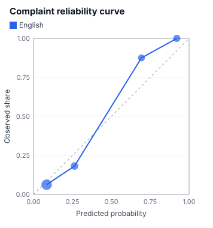

# Calibration measurement (7th Dan)

> Generated by `npm run reports`. Do not edit by hand. Regenerate after re-recording fixtures.

> ⚠️ **This report is built from hand-made sample data (synthetic). These are NOT real API measurements.**
> Do not draw any conclusion about Jev's performance from these numbers.
> Set your API key and run `npm run record` → `npm run reports` to replace them with real measurements.

- Data: `data/posts.en.json` (60 items)
- Labels: the author's example (`data/labels.json`)
- Cost: $0.0016 (38275 input tokens)

## Complaint (Noul)

| Metric | Value | How to read it |
|---|---|---|
| Accuracy (cut at 0.5) | 91.7% | Higher is better |
| Brier score | 0.088 | 0 is best. Always answering 0.5 gives 0.25 |
| ECE | 0.063 | 0 is best. Gap between "stated probability" and "observed share" |

### Moving the threshold

Decide "complaint" automatically when p ≥ t, "not a complaint" when p ≤ 1 − t, and send the rest to a person:

| threshold t | share decided automatically | of which correct | count |
|---|---|---|---|
| 0.50 | 100.0% | 91.7% | 60 |
| 0.60 | 100.0% | 91.7% | 60 |
| 0.70 | 86.7% | 92.3% | 52 |
| 0.80 | 70.0% | 95.2% | 42 |
| 0.90 | 45.0% | 92.6% | 27 |
| 0.95 | 26.7% | 87.5% | 16 |

Smallest threshold that keeps accuracy at 95.0% or more: **0.80** (decides 70.0% automatically)

## Team (Choice)

| Metric | Value |
|---|---|
| Accuracy | 91.7% |
| Brier score (multi-class) | 0.163 |
| Mean confidence (all) | 0.65 |
| Mean confidence (correct) | 0.66 |
| Mean confidence (wrong) | 0.62 |

If wrong answers have lower confidence than correct ones, the three lanes from the 3rd Dan are likely to work.

## Urgency (Score)

| Metric | Value |
|---|---|
| Level accuracy (expected value rounded) | 96.7% |
| Mean absolute error (expected − label) | 0.18 |

## Limitations

- There are 60 items. At this size, small differences fall within chance. Treat these as trends only
- One person labeled the data. The "correct answer" itself varies (6th Dan)
