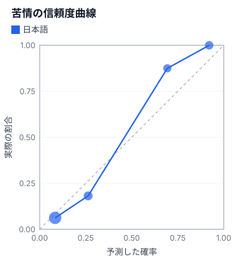

# キャリブレーション測定（七段）

> 自動生成（`npm run reports`）。手で編集しない。fixture を録り直したら作り直す。

> ⚠️ **このレポートは見本データ（合成）から作られています。実APIの測定結果ではありません。**
> ここの数字から Jev の性能について何も結論しないでください。
> APIキーを設定して `npm run record` → `npm run reports` を実行すると、本物の測定結果に置き換わります。

- データ: `data/posts.ja.json`（60 件）
- ラベル: 作者の例（`data/labels.json`）
- 費用: $0.00084（入力 19891 トークン）

## 苦情（Noul）

| 指標 | 値 | 読み方 |
|---|---|---|
| 正解率（0.5 で切った場合） | 91.7% | 高いほどよい |
| Brier score | 0.088 | 0 が最良。いつも 0.5 と答えると 0.25 |
| ECE | 0.063 | 0 が最良。「言った確率」と「実際の割合」のずれ |

### しきい値を動かすと

p ≥ t なら「苦情」、p ≤ 1 − t なら「苦情ではない」と自動で決め、その間は人に回す場合:

| しきい値 t | 自動で決めた割合 | そのうち正解 | 件数 |
|---|---|---|---|
| 0.50 | 100.0% | 91.7% | 60 |
| 0.60 | 100.0% | 91.7% | 60 |
| 0.70 | 86.7% | 92.3% | 52 |
| 0.80 | 70.0% | 95.2% | 42 |
| 0.90 | 45.0% | 92.6% | 27 |
| 0.95 | 26.7% | 87.5% | 16 |

正解率 95.0% 以上を保てる最小のしきい値: **0.80**（自動で決められるのは 70.0%）

## 担当部署（Choice）

| 指標 | 値 |
|---|---|
| 正解率 | 91.7% |
| Brier score（多クラス） | 0.163 |
| confidence の平均（全体） | 0.65 |
| confidence の平均（正解したもの） | 0.66 |
| confidence の平均（外したもの） | 0.62 |

外したものの confidence が、正解したものより低ければ、三段の3レーンが機能する見込みがあります。

## 緊急度（Score）

| 指標 | 値 |
|---|---|
| 段階の正解率（期待値を丸めた場合） | 96.7% |
| 平均絶対誤差（期待値 − ラベル） | 0.18 |

## 限界

- 件数は 60 件です。この規模では、小さな差は偶然の範囲に収まります。傾向を見る程度にとどめてください
- ラベルは1人が付けたものです。「正解」そのものに揺れがあります（六段）
