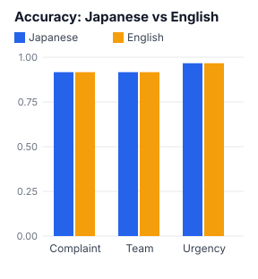
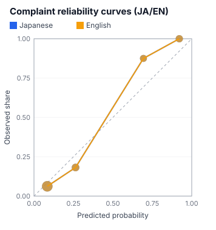

# Japanese lab (8th Dan)

> Generated by `npm run reports`. Do not edit by hand. Regenerate after re-recording fixtures.

> **Note:** **This report is built from hand-made sample data (synthetic). These are NOT real API measurements.**
> Do not draw any conclusion about Jev's performance from these numbers.
> Set your API key and run `npm run record` → `npm run reports` to replace them with real measurements.

The same 60 posts, asked the same questions in Japanese and in English.
Labels: the author's example (`data/labels.json`)

## Accuracy

| Metric | Japanese | English |
|---|---|---|
| Complaint accuracy | 91.7% | 91.7% |
| Complaint Brier score | 0.088 | 0.088 |
| Complaint ECE | 0.063 | 0.063 |
| Team accuracy | 91.7% | 91.7% |
| Team Brier score | 0.163 | 0.163 |
| Urgency accuracy | 96.7% | 96.7% |
| Input tokens | 35182 | 38275 |

## Agreement between Japanese and English

- Same team in both languages: **100.0%**
- Same complaint decision (cut at 0.5) in both languages: **100.0%**

## Confidence distribution (team)

| | Japanese | English |
|---|---|---|
| Mean | 0.65 | 0.65 |
| Median | 0.67 | 0.67 |

## Complaint accuracy by wording style

| Tag | Count | Japanese | English |
|---|---|---|---|
| indirect | 5 | 60.0% | 60.0% |
| honorific | 4 | 100.0% | 100.0% |
| sarcasm | 3 | 66.7% | 66.7% |
| omitted subject | 6 | 50.0% | 50.0% |

For tags with only a few items, one post moves the percentage a lot.

## Posts where the team differs between Japanese and English

| ID | Japanese | English | Label | Tags | Post (English) |
|---|---|---|---|---|---|
| — | — | — | — | — | no disagreements |

## Limitations

- There are 60 items. Nothing statistically strong can be claimed. Treat these as trends only
- The English posts are translations of the Japanese ones. The translation itself may affect the results
- When you see a bad number, suspect the question design first (2nd Dan), fix it, and measure again
