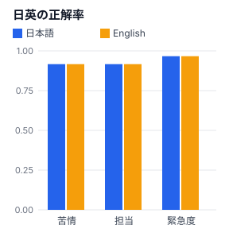
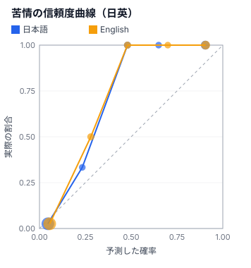

# 日本語ラボ（八段）

> 自動生成（`npm run reports`）。手で編集しない。fixture を録り直したら作り直す。

> 実APIの応答（`npm run record` で記録したもの）から作成。

同じ内容の投稿 60 件を、日本語と英語で同じ質問にかけた結果です。
ラベル: 作者の例（`data/labels.json`）

## 精度

| 指標 | 日本語 | 英語 |
|---|---|---|
| 苦情の正解率 | 91.7% | 91.7% |
| 苦情の Brier score | 0.053 | 0.057 |
| 苦情の ECE | 0.088 | 0.100 |
| 担当の正解率 | 96.7% | 96.7% |
| 担当の Brier score | 0.083 | 0.092 |
| 緊急度の正解率 | 78.3% | 80.0% |
| 入力トークン | 46387 | 45648 |

## 日英の一致率

- 担当部署が日英で同じだった割合: **100.0%**
- 苦情かどうか（0.5 で切った場合）が日英で同じだった割合: **96.7%**

## confidence の分布（担当部署）

| | 日本語 | 英語 |
|---|---|---|
| 平均 | 0.92 | 0.93 |
| 中央値 | 0.99 | 0.99 |

## 言い回し別の苦情の正解率

| タグ | 件数 | 日本語 | 英語 |
|---|---|---|---|
| 婉曲 | 5 | 80.0% | 80.0% |
| 敬語 | 4 | 75.0% | 75.0% |
| 皮肉 | 3 | 100.0% | 100.0% |
| 主語省略 | 6 | 100.0% | 83.3% |

件数が数件しかないタグは、1件の違いで割合が大きく動きます。

## 日英で担当が食い違った投稿

| ID | 日本語 | 英語 | ラベル | タグ | 投稿（日本語） |
|---|---|---|---|---|---|
| — | — | — | — | — | 食い違いなし |

## 限界

- 件数は 60 件です。統計的に強いことは言えません。「傾向」までにとどめてください
- 英語は日本語から訳したものです。訳し方そのものが結果に影響している可能性があります
- 悪い数字が出たときは、まず質問の設計（二段）を疑い、直して測り直してください
