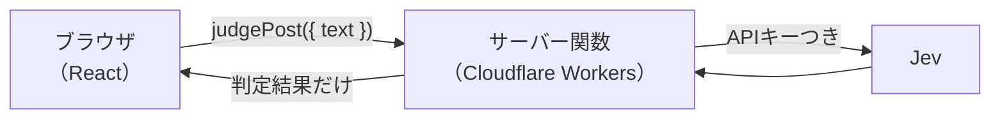

# 応用A TanStack Start + Cloudflare Workers に組み込む

- 所要時間: 45分
- 先に読む公式ページ: [JavaScript SDK](https://docs.typesafe.ai/sdk/javascript)
- この章でできるようになること: Web アプリのサーバー側から Jev を呼び、APIキーをブラウザに出さずに公開できる

## APIキーはサーバーにだけ置く

<!-- freshness: evergreen -->

ブラウザで動くコードに APIキーを書くと、ページを開いた人なら誰でもキーを盗めます。
Jev を呼ぶのは必ずサーバー側です。ブラウザは「この投稿を判定して」とサーバーに頼むだけにします。



[app/src/server/judge.ts](../../app/src/server/judge.ts) の `judgePost` は TanStack Start のサーバー関数です。ブラウザから普通の関数のように呼べますが、中身は Workers の上でだけ動きます。

```ts
export const judgePost = createServerFn({ method: "POST" })
  .validator((input: unknown) => { /* 文字数などをチェック */ })
  .handler(async ({ data }) => {
    const apiKey = env.TYPESAFE_API_KEY; // Workers の secret。ブラウザには届かない
    const client = new TypeSafeClient({ apiKey, defaultModel: facts.model.pinned });
    const r = await client.systemOne({ state: data.text, questions: boardQuestions });
    return { /* 判定結果と、三段の route() で決めたレーン */ };
  });
```

質問（`boardQuestions`）とレーン分け（`route`）は、教材の [src/lib](../../src/lib) にあるものをそのまま使っています。CLI のサンプルとアプリで同じ判断ロジックを共有できるのは、判断を純粋な関数と定義に分けておいたからです。

<details><summary>もっと深く（プロ向け）</summary>

- SDK はブラウザで動かされると既定でエラーにします（`dangerouslyAllowBrowser` を明示しない限り）。サーバーで使う前提の設計です
- SDK は実行環境として Cloudflare Workers を判定し、リクエストに含めます。Node 専用の API には依存していません
- 入力の検証（空文字、長すぎる文章）はサーバー関数の `validator` で行います。長さの上限は、コストとコンテキスト長の両方から決めます
- 公式スキルも「Web アプリでは API の認証情報をサーバー側に置く」としています

</details>

> 一次情報: https://docs.typesafe.ai/sdk/javascript

## キーがなければデモモード、あれば自由な文章を判定できる

<!-- freshness: volatile -->

キーがなくても、見本の投稿だけは判定できる「デモモード」で動きます。キーを入れると、自由に書いた文章も判定できます。

```bash
cd app
npm install
npm run dev          # http://localhost:3000
```

キーを使うとき:

```bash
cp .dev.vars.example .dev.vars   # ローカル。TYPESAFE_API_KEY= にキーを入れる
npx wrangler secret put TYPESAFE_API_KEY   # 本番（Cloudflare）
npm run deploy
```

| モード | 条件 | 判定できるもの |
|---|---|---|
| デモ | キーなし | 見本の投稿のみ（`fixtures/board-ja` を同梱して再生） |
| live | キーあり | 自由に書いた文章 |

緊急度が高い投稿には、レーンにかかわらず「すぐ人が対応」と目立つ表示を出します（応用B と同じ方針）。

<details><summary>もっと深く（プロ向け）</summary>

- 構成は TanStack の公式サンプル（start-basic-cloudflare）に沿っています。`@cloudflare/vite-plugin` が Vite の SSR 環境を Workers として動かします
- `wrangler types` が生成する `worker-configuration.d.ts` で、`cloudflare:workers` の型が付きます（`npm install` の後に自動で実行）
- 公開するなら、呼び出し回数の制限（Cloudflare の Rate Limiting など）と、九段の予算の考え方を必ず足してください。誰でも叩けるエンドポイントは、そのまま誰でも使える課金口になります
- ここに書いたコマンドやパッケージのバージョンは変わりやすい情報です。動かないときは TanStack Start と Cloudflare の公式ドキュメントを確認してください

</details>

> 一次情報: https://docs.typesafe.ai/sdk/javascript
