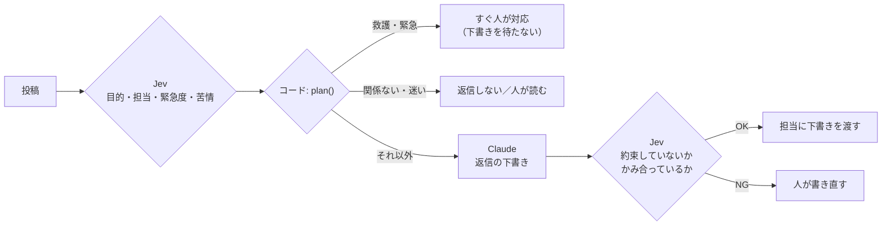

# 応用B LLMとの二層構成（Jevが決め、LLMが書く）

- 所要時間: 30分
- 先に読む公式ページ: [How to build with System One](https://docs.typesafe.ai/concepts/how-to-build-with-system-one) / [Citation check](https://docs.typesafe.ai/cookbooks/citation_check)
- この章でできるようになること: 判断は Jev、文章は LLM、方針はコード、という分担で機能を組める

## 判断は Jev、文章は LLM、方針はコードが持つ

<!-- freshness: evergreen -->

返事の文章を書くのは、文章が得意な LLM（ここでは Claude）に任せます。
でも「返事をするか」「誰が対応するか」「急ぐか」は、LLM に考えさせません。それは Jev が判断し、コードが決めます。



[src/steps/ob-two-layer.ts](../../src/steps/ob-two-layer.ts):

1. Jev が、仕分けの3問と、四段の「目的（intent）」を1回で判断する
2. コードの `plan()` が方針を決める。安全にかかわるものは、LLM を通さずすぐ人へ
3. Claude が、決まった方針（担当・トーン）に沿って2〜3文の下書きを書く
4. Jev が下書きを検査する（投稿にない事実や約束を書いていないか）

```bash
npm run ob
```

<details><summary>もっと深く（プロ向け）</summary>

- LLM に渡すのは「決まったこと」だけです。判断の材料をもう一度考えさせると、Jev とちがう判断をされたときに、どちらが正しいのかわからなくなります
- 公式スキルの「検証してエスカレーションする」パターン: 特定の主張を根拠と照らして確かめ、不確かなものや失敗したものを人か推論モデルに回す
- 安全にかかわる経路に生成モデルを入れないのは、遅延と失敗の可能性を減らすためです

</details>

> 一次情報: https://docs.typesafe.ai/concepts/how-to-build-with-system-one

## Claude は公式 SDK で呼び、断られたら人に回す

<!-- freshness: volatile -->

Claude は Anthropic の公式 SDK で呼びます。Jev と同じく、キーがなくても記録済みの見本で動きます。

```ts
const response = await claude.beta.messages.create({
  model: "claude-opus-5",
  max_tokens: 1024,
  output_config: { effort: "low" },
  betas: ["server-side-fallback-2026-07-01"],
  fallbacks: "default",
  system: prompt.system,
  messages: [{ role: "user", content: prompt.user }],
});
if (response.stop_reason === "refusal") { /* 下書きなしで人に回す */ }
```

- 短い下書きなので `effort: "low"` にしています
- `fallbacks: "default"` は、安全分類器に断られたときにサーバー側で別のモデルに回す設定です
- `stop_reason` が `refusal` のときは本文を読まず、人に回します

live で動かすには、`.env` に `ANTHROPIC_API_KEY` も入れます。Claude の費用は Jev とは別に、Anthropic の料金でかかります。

<details><summary>もっと深く（プロ向け）</summary>

- 記録／再生は Anthropic SDK の `fetch` オプションに、Jev と同じ仕組み（[src/lib/fixtures.ts](../../src/lib/fixtures.ts)）を渡して実現しています
- 見本の下書きと検査の値は、手で作ったものです。実際の下書きの品質と検査の精度は、live で確かめてください
- モデルID や beta の名前は変わりやすい情報です。Anthropic の公式ドキュメントで確認してください

</details>

> 一次情報: https://docs.typesafe.ai/cookbooks/citation_check
