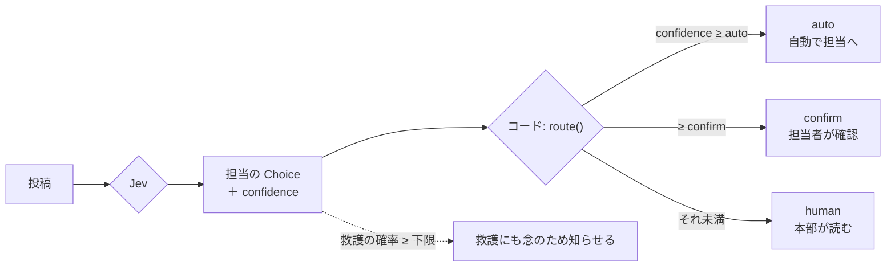

# 三段 confidence

- 所要時間: 30分
- 先に読む公式ページ: [Confidence](https://docs.typesafe.ai/confidence) / [Confidence-gated routing](https://docs.typesafe.ai/patterns/confidence-routing)
- この章でできるようになること: probability と confidence のちがいを説明でき、3レーン（自動 / 確認 / 人間）を実装できる

## confidence は「迷わずに選べたか」

<!-- freshness: evergreen -->

6級で見たとおり、probability は「それぞれの選択肢である見込み」、confidence は「迷わずに選べたか」です。
迷わずに選べた投稿は機械に任せ、迷った投稿は人が見る。これが3レーンの考え方です。

| 答えの種類 | 迷いの見方 |
|---|---|
| Choice / Score | `confidence`（分布がどれだけ一か所に集まっているか） |
| Noul | confidence は**ない**。`noul` が 0.5 に近いほど「はい」と「いいえ」が同じくらい |

Noul の 0.5 は「中くらい苦情」という意味ではありません。「苦情である見込み」と「苦情でない見込み」が同じくらい、という意味です。

<details><summary>もっと深く（プロ向け）</summary>

公式スキルの注意点:

- Choice / Score の confidence は分布の集中度の要約で、「ワークフロー全体が正しいこと」や「実行してよいという許可」ではない
- 受け入れてよい選択肢が複数あれば、確率はそれらに分散する。confidence が低くても、害のない好みの選択なら問題ないこともある
- 使わない分岐の迷いは無視してよい

</details>

> 一次情報: https://docs.typesafe.ai/confidence

## 迷わず選べた投稿は自動、迷った投稿は人へ回す

<!-- freshness: semi-stable -->

- **auto** … 自信あり。自動で担当の係へ
- **confirm** … 候補はあるが迷いあり。係の人が一度確認してから受ける
- **human** … 決め手なし。本部の人が読んで決める



振り分けは [src/lib/lanes.ts](../../src/lib/lanes.ts) の `route` 関数です。Node の API を使わない純粋関数なので、応用A の Cloudflare Workers のアプリでも同じものを使っています。

```ts
export const DEFAULT_THRESHOLDS: LaneThresholds = { auto: 0.7, confirm: 0.4, safetyFloor: 0.2 };
```

```bash
npm run d3
```

60件をレーンに分け、レーンごとに「作者のラベルとどれだけ一致したか」を表示します。auto のレーンの一致率が confirm より高くなっていれば、confidence がレーン分けに役立っている、ということです。

<details><summary>もっと深く（プロ向け）</summary>

- `safetyFloor` は「1位ではないが、救護の可能性が少しでもあるなら救護にも知らせる」という**安全側の方針**です。見落としのコストが高いものは、確率の1位だけで決めません
- しきい値は仮の値です。七段で、自分のデータで測ってから決め直します
- レーンごとの件数は、人の手間の見積もりに直結します。confirm と human の件数×1件あたりの確認時間が、運用のコストです

</details>

> 一次情報: https://docs.typesafe.ai/patterns/confidence-routing
