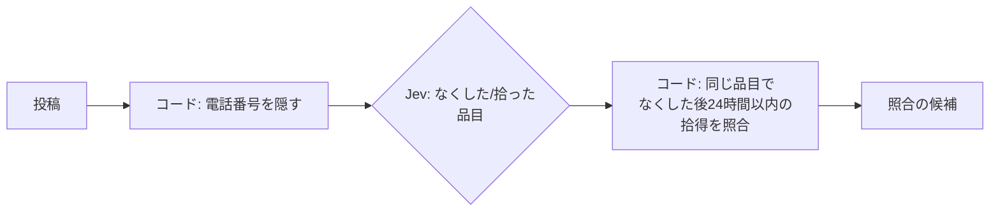

# 五段 コードとJevの境界

- 所要時間: 30分
- 先に読む公式ページ: [How to build with System One](https://docs.typesafe.ai/concepts/how-to-build-with-system-one)
- この章でできるようになること: 業務の判断を見て、コードに残す部分と Jev に渡す部分を分けられる

## ルールで書き切れるならコード、書き切れないなら Jev

🟢 恒久

### ひとことで

計算・日付の比較・決まったルール・表の照合は、コードのほうが速くて、安くて、まちがえません。
「この文章は、なくした話？拾った話？」のような、**言葉の意味がわからないと決められないこと**だけを Jev に聞きます。

### ちゃんと言うと

| コードがやる | Jev に聞く |
|---|---|
| 電話番号を隠す（決まった形の文字列） | なくしたのか、拾ったのか |
| 受付時刻を比べる | 話題になっている物は何か |
| 同じ品目どうしを照合する | |
| 24時間以内かどうか | |

迷ったら「その判断は、ルールを書き切れるか？」と自分に聞きます。書き切れるならコード、書き切れないなら Jev です。

<details><summary>もっと深く（プロ向け）</summary>

- 公式スキルは「既知のルール・計算・完全一致の検索・実行はコードに残す。意味の理解が必要なところに Jev を足す」としています
- 「コードがワークフローを持ち、モデルは普通のコードでは書けない常識を供給する」という分担です。ワークフローの制御を Jev に渡そうとしないでください

</details>

> 一次情報: https://docs.typesafe.ai/concepts/how-to-build-with-system-one

## 落とし物は、判定を Jev、照合をコードが受け持つ

🟡 半恒久

### ひとことで

落とし物コーナーに届いた6件の投稿を、Jev に「なくした／拾った」「何の物か」だけ判定させ、照合はコードでやります。

### ちゃんと言うと

[src/steps/d5-boundary.ts](../../src/steps/d5-boundary.ts) の流れ:



```bash
npm run d5
```

r6 も「青い水筒」ですが、なくすより前の日付なので候補から外れます。これは Jev ではなくコードが決めることです。

<details><summary>もっと深く（プロ向け）</summary>

- 個人情報を外部に送る前にコードで隠すのは、精度の話ではなくデータの取り扱いの話です。送らずに済むものは送りません
- 品目の選択肢を増やしすぎると、似た選択肢の間で確率が割れます。照合に必要な粒度だけにします
- 公式スキルの「生成するのではなく選ぶ」パターン: コードで候補を見つけ、Jev にどれかを選ばせ、値そのものはコードがコピーする。Jev は候補にないものを選べないので、候補の網羅はコードの責任です

</details>

> 一次情報: https://docs.typesafe.ai/cookbooks/pre_parsed_value_extraction_cookbook
