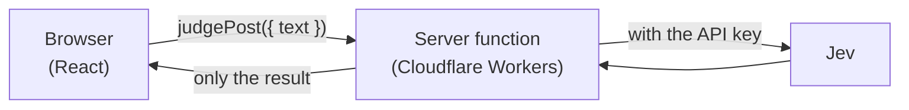

# Advanced A: TanStack Start + Cloudflare Workers

- Time: 45 min
- Read first (official): [JavaScript SDK](https://docs.typesafe.ai/sdk/javascript)
- You will be able to: call Jev from the server side of a web app and publish it without exposing your API key to the browser

## The API key lives only on the server

🟢 Evergreen

### In one line

If you put an API key in code that runs in the browser, anyone who opens the page can steal it.
Jev is always called from the server. The browser only asks the server, "please judge this post."

### Properly



`judgePost` in [app/src/server/judge.ts](../../../app/src/server/judge.ts) is a TanStack Start server function. The browser can call it like an ordinary function, but its body only ever runs on Workers.

```ts
export const judgePost = createServerFn({ method: "POST" })
  .validator((input: unknown) => { /* check length and so on */ })
  .handler(async ({ data }) => {
    const apiKey = env.TYPESAFE_API_KEY; // a Workers secret; it never reaches the browser
    const client = new TypeSafeClient({ apiKey, defaultModel: facts.model.pinned });
    const r = await client.systemOne({ state: data.text, questions: boardQuestions });
    return { /* the result, plus the lane chosen by the three-lane route() */ };
  });
```

The questions (`boardQuestions`) and the lane routing (`route`) are taken as is from the course's [src/lib](../../../src/lib). The CLI samples and the app can share the same decision logic because the decisions were kept as pure functions and definitions.

The web app's screens in `app/` are in Japanese only; the server-side logic is the same code the course uses.

<details><summary>Going deeper (for pros)</summary>

- By default the SDK throws an error when run in a browser (unless you explicitly set `dangerouslyAllowBrowser`). It is designed to be used on a server
- The SDK detects Cloudflare Workers as its runtime and includes that in the request. It does not depend on Node-only APIs
- Input validation (empty text, text that is too long) happens in the server function's `validator`. Choose the length limit with both cost and context length in mind
- The official skill also says "in web apps, keep API credentials on the server side"

</details>

> Primary source: https://docs.typesafe.ai/sdk/javascript

## Without a key it runs in demo mode; with a key it judges any text

🔴 Volatile

### In one line

Without a key, the app runs in "demo mode," which can judge only the sample posts. Add a key and it can judge any text you type.

### Properly

```bash
cd app
npm install
npm run dev          # http://localhost:3000
```

When using a key:

```bash
cp .dev.vars.example .dev.vars   # local. Put your key after TYPESAFE_API_KEY=
npx wrangler secret put TYPESAFE_API_KEY   # production (Cloudflare)
npm run deploy
```

| Mode | Condition | What it can judge |
|---|---|---|
| Demo | No key | Sample posts only (replays the bundled `fixtures/board-ja`) |
| live | Key set | Any text you type |

For highly urgent posts, the app shows a prominent "a person responds now" notice, whatever the lane (the same policy as Advanced B).

<details><summary>Going deeper (for pros)</summary>

- The setup follows TanStack's official example (start-basic-cloudflare). `@cloudflare/vite-plugin` runs Vite's SSR environment as Workers
- `worker-configuration.d.ts`, generated by `wrangler types`, provides the types for `cloudflare:workers` (it runs automatically after `npm install`)
- If you make it public, always add a limit on the number of calls (for example Cloudflare's Rate Limiting) and the budget thinking from the 9th Dan. An endpoint anyone can hit is a billing tap anyone can use
- The commands and package versions here change easily. If something does not work, check the official TanStack Start and Cloudflare docs

</details>

> Primary source: https://docs.typesafe.ai/sdk/javascript
