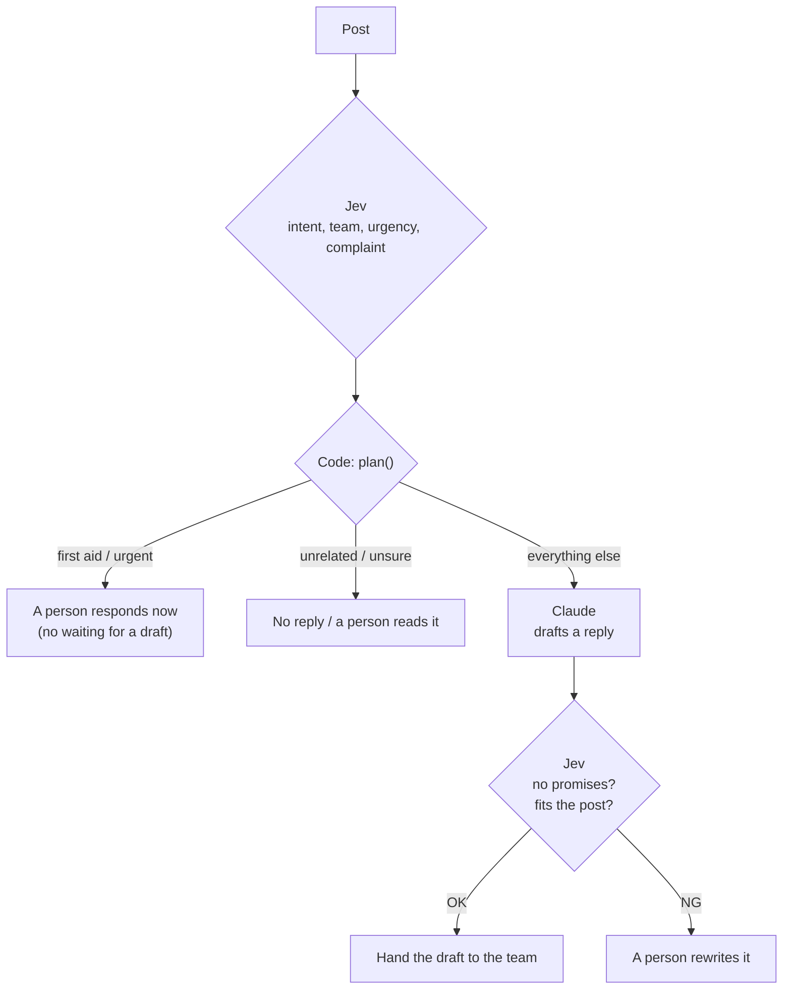

# Advanced B: Two layers with an LLM (Jev decides, the LLM writes)

- Time: 30 min
- Read first (official): [How to build with System One](https://docs.typesafe.ai/concepts/how-to-build-with-system-one) / [Citation check](https://docs.typesafe.ai/cookbooks/citation_check)
- You will be able to: build a feature where Jev makes the judgments, the LLM writes the text, and the code owns the policy

## Jev judges, the LLM writes, and the code owns the policy

<!-- freshness: evergreen -->

Writing the reply is left to an LLM that is good at writing (here, Claude).
But "should we reply?", "who handles it?" and "is it urgent?" are not left to the LLM. Jev judges those, and the code decides.



[src/steps/ob-two-layer.ts](../../../src/steps/ob-two-layer.ts):

1. Jev judges the three sorting questions and the 4th Dan "intent" in one call
2. The code's `plan()` decides the policy. Anything involving safety goes straight to a person, without passing through the LLM
3. Claude writes a 2-3 sentence draft that follows the decided policy (team and tone)
4. Jev checks the draft (does it state facts or make promises that are not in the post?)

The system prompt Claude receives (English version):

```text
You are a staff member of a local festival, drafting replies to posts on the message board.
Write in English, in 2-3 sentences, in a warm and polite tone.
Do not state facts that are not in the post, such as times, amounts, or outcomes. Do not make promises that may not be kept.
Output only the body of the draft.
```

```bash
npm run ob
```

<details><summary>Going deeper (for pros)</summary>

- The LLM receives only "what has been decided." If you make it reconsider the evidence, then when it disagrees with Jev you can no longer tell which one is right
- The official skill's "verify and escalate" pattern: check specific claims against the evidence, and send uncertain or failed ones to a person or a reasoning model
- Keeping a generative model off the safety path reduces latency and the chance of failure

</details>

> Primary source: https://docs.typesafe.ai/concepts/how-to-build-with-system-one

## Call Claude with the official SDK, and hand refusals to a person

<!-- freshness: volatile -->

Claude is called with Anthropic's official SDK. Like Jev, it runs on recorded samples even without a key.

```ts
const response = await claude.beta.messages.create({
  model: "claude-opus-5",
  max_tokens: 1024,
  output_config: { effort: "low" },
  betas: ["server-side-fallback-2026-07-01"],
  fallbacks: "default",
  system: prompt.system,
  messages: [{ role: "user", content: prompt.user }],
});
if (response.stop_reason === "refusal") { /* hand it to a person with no draft */ }
```

- The draft is short, so it uses `effort: "low"`
- `fallbacks: "default"` tells the server to switch to another model when the safety classifier refuses
- When `stop_reason` is `refusal`, the body is not read and the post goes to a person

To run it live, also put `ANTHROPIC_API_KEY` in `.env`. Claude costs money separately from Jev, at Anthropic's prices.

<details><summary>Going deeper (for pros)</summary>

- Recording and replay work by passing the same mechanism as Jev ([src/lib/fixtures.ts](../../../src/lib/fixtures.ts)) to the Anthropic SDK's `fetch` option
- The sample drafts and check values were made by hand. Check the real draft quality and check accuracy in live mode
- Model IDs and beta names change easily. Confirm them in Anthropic's official docs

</details>

> Primary source: https://docs.typesafe.ai/cookbooks/citation_check
