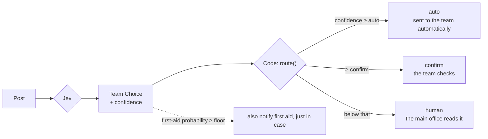

# 3rd Dan: Confidence

- Time: 30 min
- Read first (official): [Confidence](https://docs.typesafe.ai/confidence) / [Confidence-gated routing](https://docs.typesafe.ai/patterns/confidence-routing)
- You will be able to: explain the difference between probability and confidence, and implement three lanes (auto / confirm / human)

## Confidence tells you "was it an easy pick?"

🟢 Evergreen

### In one line

As you saw in Kyu 6, probability is "how likely each option is", and confidence is "was it an easy pick?".
Posts that were an easy pick go to the machine; posts where it hesitated go to a person. That is the idea behind the three lanes.

### Properly

| Answer type | How to see hesitation |
|---|---|
| Choice / Score | `confidence` (how much the distribution is concentrated in one place) |
| Noul | There is **no** confidence. The closer `noul` is to 0.5, the more "yes" and "no" are equally likely |

A Noul of 0.5 does not mean "a medium-sized complaint". It means "it is a complaint" and "it is not a complaint" are about equally likely.

<details><summary>Going deeper (for pros)</summary>

Points the official skill warns about:

- Confidence for Choice / Score summarizes how concentrated the distribution is. It is not "the whole workflow is correct", nor "permission to act"
- If several options are acceptable, the probability spreads across them. Low confidence may be fine when the choice is a harmless preference
- You can ignore hesitation in branches you will not use

</details>

> Primary source: https://docs.typesafe.ai/confidence

## Easy picks run automatically; uncertain posts go to a person

🟡 Semi-stable

### In one line

- **auto** … Confident. Sent automatically to the right team
- **confirm** … There is a candidate, but some doubt. Someone on that team checks it once before accepting
- **human** … No clear winner. Someone at the main office reads it and decides

### Properly



The routing is the `route` function in [src/lib/lanes.ts](../../../src/lib/lanes.ts). It is a pure function that uses no Node APIs, so the Cloudflare Workers app in Advanced A uses the same one.

```ts
export const DEFAULT_THRESHOLDS: LaneThresholds = { auto: 0.7, confirm: 0.4, safetyFloor: 0.2 };
```

```bash
npm run d3
```

It sorts the 60 posts into lanes and shows, for each lane, how often the result agrees with the author's labels. If the auto lane agrees more often than the confirm lane, confidence is doing useful work in the lane split.

<details><summary>Going deeper (for pros)</summary>

- `safetyFloor` is a **play-it-safe policy**: "even if kyugo (first aid and safety) is not in first place, notify first aid too if there is any real chance it is their case". When a miss is costly, do not decide by the top probability alone
- The thresholds are provisional values. In the 7th Dan you measure on your own data and set them again
- The number of posts per lane feeds straight into your estimate of human workload. The confirm and human counts × the time to check one post is your operating cost

</details>

> Primary source: https://docs.typesafe.ai/patterns/confidence-routing
