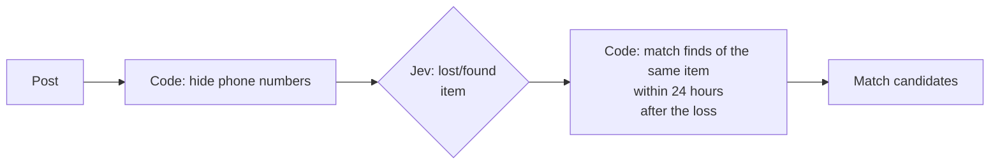

# 5th Dan: Where code ends and Jev begins

- Time: 30 min
- Read first (official): [How to build with System One](https://docs.typesafe.ai/concepts/how-to-build-with-system-one)
- You will be able to: look at a business decision and split it into the part that stays in code and the part you hand to Jev

## If you can write the rule out in full, use code; if you cannot, use Jev

<!-- freshness: evergreen -->

Arithmetic, date comparisons, fixed rules and table lookups are faster, cheaper and error-free in code.
Ask Jev only about things **you cannot decide without understanding what the words mean**, such as "Is this text about losing something or finding something?"

| Code does it | Ask Jev |
|---|---|
| Hide phone numbers (strings with a fixed shape) | Was it lost or found? |
| Compare the time a post was received | What item is the post about? |
| Match posts about the same item | |
| Check whether it is within 24 hours | |

When in doubt, ask yourself: "Can I write this decision out in full as rules?" If you can, use code. If you cannot, use Jev.

<details><summary>Going deeper (for pros)</summary>

- The official skill says: "Keep known rules, calculations, exact lookups and execution in code. Add Jev where understanding meaning is needed"
- The division of labor is "code owns the workflow; the model supplies the common sense that ordinary code cannot express". Do not try to hand control of the workflow to Jev

</details>

> Primary source: https://docs.typesafe.ai/concepts/how-to-build-with-system-one

## For lost items, Jev classifies and code does the matching

<!-- freshness: semi-stable -->

For six posts that arrived at the lost-and-found desk, Jev decides only "lost or found" and "what item", and code does the matching.

The flow in [src/steps/d5-boundary.ts](../../../src/steps/d5-boundary.ts):



```bash
npm run d5
```

r6 is also "a blue water bottle", but its date is before the loss, so it drops out of the candidates. Code decides this, not Jev.

<details><summary>Going deeper (for pros)</summary>

- Hiding personal information in code before sending it outside is about data handling, not accuracy. If you do not need to send something, do not send it
- If you add too many item options, the probability splits between similar options. Keep only the granularity the matching needs
- The official skill's "choose rather than generate" pattern: code finds the candidates, Jev picks one of them, and code copies the value itself. Jev cannot pick something that is not among the candidates, so covering all candidates is code's responsibility

</details>

> Primary source: https://docs.typesafe.ai/cookbooks/pre_parsed_value_extraction_cookbook
