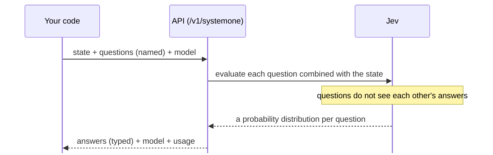

# Okugi: Understanding the mechanism

- Time: 60 min
- Read first (official): [System One](https://docs.typesafe.ai/concepts/system-one) / [Confidence](https://docs.typesafe.ai/confidence) / [Models](https://docs.typesafe.ai/models)
- You will be able to: explain what happens when you ask Jev once, sorting each point into "confirmed", "general knowledge" and "unknown"

In this chapter, every statement carries one of these markers.

| Marker | Meaning |
|---|---|
| **[Confirmed]** | Stated in the official agent skill (SKILL.md), the official SDK's type definitions, or the README of an integration package, and checked by the author of this course by reading it |
| **[General]** | General machine-learning knowledge. The official docs do not say that Jev works this way |
| **[Unknown]** | Something that could not be confirmed when this course was written |

Being a "Jev master" does not mean knowing the internals. It means **being able to say exactly where the line runs between what is known and what is not**.

## Questions are answered at the same time, without seeing each other's answers

<!-- freshness: semi-stable -->

Give Jev one post and ask three questions, and the three questions are answered at the same time, separately.
Answers always come back in a fixed shape (with probabilities). Not a single character of text is generated.



- **[Confirmed]** A question's ID (a key such as `isComplaint`) is not sent to the model. It is a name for your code (SKILL.md)
- **[Confirmed]** Independent questions about the same state run in parallel and cannot see each other's answers (SKILL.md)
- **[Confirmed]** For each question, the response holds `noul` for a Noul; `choice`, `confidence` and `probabilities` for a Choice; and `score`, `confidence`, `legend` and `probabilities` for a Score (SDK type definitions)
- **[Confirmed]** A Score's `score` is the expected value weighted by probability, so it can be a decimal between levels (SDK type definitions, SKILL.md)
- **[Confirmed]** Values are returned rounded to 2 decimal places (README of the TypeSafe provider for the Vercel AI SDK)
- **[Confirmed]** Jev does not generate text or explanations of its reasoning; it returns typed answers and probabilities (SKILL.md)
- **[Unknown]** How many times the model runs per question inside the API

<details><summary>Going deeper (for pros)</summary>

- You can check the output-token price and the actual `usage.output_tokens` in [facts.en.md](../../_generated/facts.en.md#pricing) and in recorded responses. The command in the next section checks this across all recorded responses
- "Questions do not see each other's answers" has a direct effect on design. For questions that depend on each other, either write the assumption into the question and ask speculatively (4th Dan), or split them into two calls

</details>

> Primary source: https://docs.typesafe.ai/concepts/system-one

## score is an expected value; confidence is how concentrated the distribution is

<!-- freshness: evergreen -->

- A Choice spreads probability across all the options and picks the one with the most
- A Score takes the probability of each level and works out the "average level"
- confidence is how much the probability is gathered in one place

**[General]** A classification model usually computes a "score" for each option and turns those into probabilities that add up to 1 (softmax).

**[Confirmed]** The expected value for a Score:

```
score = Σ (level × probability of that level)
e.g.  0 × 0.18 + 1 × 0.64 + 2 × 0.18 = 1.00
```

**[Confirmed]** The confidence of a Choice / Score is "a summary of how concentrated the distribution is" (SKILL.md). It does not mean the whole workflow is correct, and it is not permission to act.

**[General]** One example of a way to measure concentration is **1 − normalized entropy**.

```
entropy H = −Σ p log p
normalized entropy = H ÷ log(number of options)   (1 if perfectly flat, 0 if all in one place)
concentration = 1 − normalized entropy
```

**[Unknown]** Which formula Jev actually uses to compute confidence. The formula above is a yardstick for comparison; nothing says it is Jev's formula.

This course's functions are in [src/lib/mechanics.ts](../../../src/lib/mechanics.ts).

<details><summary>Going deeper (for pros)</summary>

- A Noul has no confidence **[Confirmed]**. A Noul of 0.5 means "yes" and "no" are about equally likely, not "medium strength" **[Confirmed]**
- The top probability and confidence are different quantities. With many options, the whole distribution can be flat even when the top option has a fair probability
- Because of rounding, probabilities can add up to slightly more or less than 1. When a test compares the sum, allow some tolerance

</details>

> Primary source: https://docs.typesafe.ai/confidence

## Check the mechanism against your own data

<!-- freshness: semi-stable -->

Do not just believe what is written. Go through every recorded response and check that it really behaves that way.

```bash
npm run okugi
```

It reads every recorded response in `fixtures/` and checks the following (it does not call the API).

| Kind | What it checks |
|---|---|
| Shape properties | noul and probabilities are between 0 and 1, probabilities sum to about 1, choice is the most probable label, score is the expected value |
| Observations | the number of decimal places in probabilities, the correlation between confidence and "1 − normalized entropy", whether output tokens are always 0, the correlation between input tokens and state length |

**The responses bundled now are sample data (synthetic).** The samples are generated with the course's own formulas, so the "observations" only reflect how the samples were made. Only after you replace them with real API responses via `npm run record` and run this again do they become evidence about Jev.

<details><summary>Going deeper (for pros)</summary>

- "choice is the most probable label": the SDK's type definitions only say "the chosen label". This, including how ties are handled, is something to check on real data
- Even a high correlation between confidence and concentration does not prove the formulas are the same. It only suggests there is a monotonic relationship
- If even one response breaks a shape property, save that response as is and report it. Reproducible evidence is the most valuable kind

</details>

> Primary source: https://docs.typesafe.ai/api

## What System One is, and what is not known

<!-- freshness: evergreen -->

Human thinking has "fast thinking" (System 1), which decides in a flash, and "slow thinking" (System 2), which thinks things through.
Jev is an AI that specializes in the fast kind of judgment only.

- **[Confirmed]** Jev is the first flagship model among TypeSafe's System One models. It understands natural language and, instead of generating text, returns typed answers and probabilities (SKILL.md)
- **[Confirmed]** System One models are trained to make calibrated judgments. Even so, verify performance in your own domain (SKILL.md)
- **[Confirmed]** English is the main training language, and other languages are not necessarily as good. If you use it in a language other than English, test it on your own content (the Models page of the official docs)
- **[General]** "System 1 / System 2" is a distinction made by the psychologist Daniel Kahneman
- **[Unknown]** The model's architecture, number of parameters, training data, training method (including RLCD in the glossary), the formula for confidence, and how the text of criteria is used

We do not fill in the unknown parts with guesses. When they can be confirmed in the official docs, we will update this chapter and the glossary.

<details><summary>Going deeper (for pros)</summary>

- Even without knowing the internals, every property you need to use it well (shape, what the probabilities mean, calibration, language gaps, weak spots) can be measured from the outside. The 6th to 8th Dan of this course and `npm run okugi` are the tools for that
- You may see guesses such as "Jev must be using an LLM inside" or "it just extracts logits". This course has not been able to verify them, so it does not cover them

</details>

> Primary source: https://docs.typesafe.ai/models
