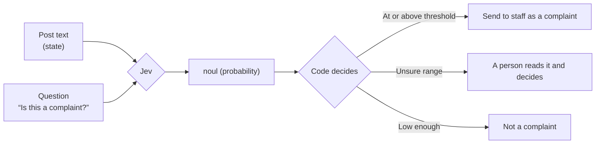

# Kyu 7: Noul (yes/no)

- Time: 20 min
- Read first (official): [Primitives](https://docs.typesafe.ai/primitives) / [Noul](https://docs.typesafe.ai/primitives/noul)
- You will be able to: decide "Is this a complaint?", and explain what it means that you get a probability back

## You get back the probability of "yes"

<!-- freshness: evergreen -->

When you ask "Is this a complaint?", Jev does not answer "yes" or "no". It answers with **the probability of "yes"**.
0.94 means "almost certainly a complaint"; 0.5 means "could go either way."

```ts
import { noul } from "@typesafe-ai/sdk";

export const isComplaint = noul("Is this post a complaint about the organizers?", {
  true: "The writer describes a problem, dissatisfaction, or a request for improvement",
  false: "A question, thanks, a report, or anything else that is not a complaint",
});

const result = await client.systemOne({
  state: post.text,
  questions: { isComplaint },
});

result.answers.isComplaint.noul; // A number from 0 to 1: the probability of "yes"
```

- The first argument (`instructions`) is the question
- The second argument (`criteria`) is optional. Writing down what "yes" and what "no" each mean makes the basis for the judgment clear

```bash
npm run k07
```

<details><summary>Going deeper (for pros)</summary>

- The SDK infers the return type from the question definitions. `answers.isComplaint.noul` is a `number`, and writing a name that does not exist is a compile error
- Where "a complaint" begins differs from person to person. `criteria` is the tool for pinning that line down in words. The 2nd Dan tests how the wording moves the probability
- Being told "0.61" for a complaint does not tell you whether it is really 61% likely (whether it is calibrated). That is a separate question, measured in the 7th Dan

</details>

> Primary source: https://docs.typesafe.ai/primitives/noul

## Your code decides what to do with the probability

<!-- freshness: evergreen -->

Jev only tells you "complaint-ness: 0.83."
Deciding "send it to staff if it is 0.8 or higher" is your code's job.



The `decide` function in [src/steps/k07-noul.ts](../../../src/steps/k07-noul.ts) is this branch.

```ts
export const ACTIONS = {
  escalate: "Send to staff as a complaint",
  review: "A person reads it and decides",
  none: "Not a complaint",
} as const;

export function decide(probability: number, threshold = AUTO_THRESHOLD): Action {
  if (probability >= threshold) return ACTIONS.escalate;
  if (probability >= 1 - threshold) return ACTIONS.review;
  return ACTIONS.none;
}
```

`decide` is an ordinary function that never calls Jev, so you can test it without an API key ([tests/unit/decisions.test.ts](../../../tests/unit/decisions.test.ts)).

<details><summary>Going deeper (for pros)</summary>

- The threshold here is a placeholder. **A threshold chosen by gut feeling is almost certainly off in production**. The 3rd Dan builds three lanes (auto / check / human), and the 7th Dan chooses the thresholds again from your own data
- Sending the "unsure range" to a person matters most where a wrong call is expensive. Missing a complaint and treating a thank-you note as a complaint do not cost the same

</details>

> Primary source: https://docs.typesafe.ai/primitives
