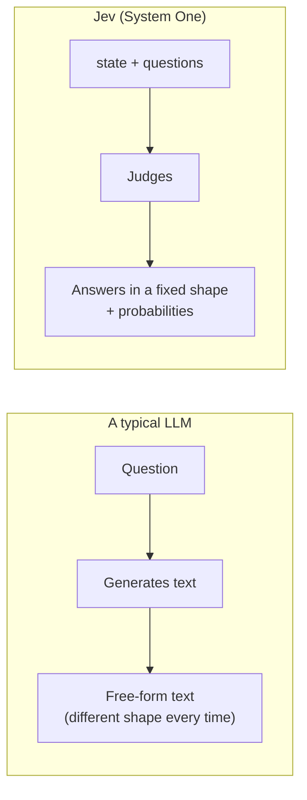

# Kyu 10: What is Jev?

- Time: 15 min
- Read first (official): [Introduction](https://docs.typesafe.ai/introduction) / [System One](https://docs.typesafe.ai/concepts/system-one)
- You will be able to: explain the difference between an LLM and Jev with a picture, and try it once in the Playground

## Jev is an AI that does not write text

🟢 Evergreen

### In one line

AIs like ChatGPT answer your question **in sentences**.
Jev does not write sentences. It answers "yes or no", "which of A, B or C", or "how many points", **with probabilities**.
Think of a student filling in a multiple-choice answer sheet, not a student writing an essay.

### Properly

Jev is a **System One model** from TypeSafe AI.
It takes "the material for the judgment" (state) and "the questions" (questions) as input, and returns only answers in a fixed shape (a schema).



| | A typical LLM | Jev |
|---|---|---|
| Returns | Text | Yes/no, a pick from options, a score (with probabilities) |
| Shape | Can differ every time | Never returns a value outside the schema |
| Good at | Writing, summarizing, conversation | Sorting, choosing, rating |

<details><summary>Going deeper (for pros)</summary>

- The name comes from Kahneman's System 1 (fast, intuitive judgment) and System 2 (slow deliberation). Jev specializes in the first: fast judgment
- You can make an LLM answer in JSON (structured output) to get a consistent shape, but then the probabilities are "values that come along with the text." Jev is a model whose purpose from the start is to return a probability distribution
- **Type-safe ≠ factually correct**. Never returning a value outside the schema is one thing; making the right judgment is another. The 10th Dan covers this distinction in detail

</details>

> Primary source: https://docs.typesafe.ai/concepts/system-one

## Try the official demo first, then do the same thing in this repository

🔴 Volatile

### In one line

First, try it in your browser without installing anything.

### Properly

In the official interactive demo (Jev Lab), type in some text and a question, and watch the answer come back.
This course does not build its own demo, because the official one is the most up to date and the most accurate.

Once you have tried it, do the same thing with the samples in this repository.

```bash
npm run demo   # No API key needed: replays recorded results
npm run k10    # After you add a key: the real API
```

`npm run k10` asks "Is this post a question for the organizers?" about the local festival message board post "Will the Bon dance go ahead even if it rains?" ([src/steps/k10-hello.ts](../../../src/steps/k10-hello.ts)).

<details><summary>Going deeper (for pros)</summary>

Only the Kyu 10 sample uses `jev-latest` (an alias) as the model, because it is friendlier for a first run to use the newest one.
From Kyu 9 on, the samples are pinned to the version this course was verified with (for the pinned version, see [facts.en.md](../../_generated/facts.en.md#model)).
Why we pin is covered in the 9th Dan.

</details>

> Primary source: https://docs.typesafe.ai/introduction
