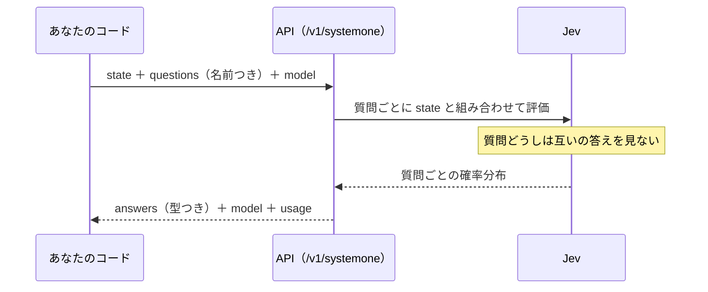

# 奥義 仕組みを理解する

- 所要時間: 60分
- 先に読む公式ページ: [System One](https://docs.typesafe.ai/concepts/system-one) / [Confidence](https://docs.typesafe.ai/confidence) / [Models](https://docs.typesafe.ai/models)
- この章でできるようになること: Jev に1回聞いたときに何が起きているかを、「確かめられたこと」「一般論」「わかっていないこと」に分けて説明できる

この章では、どの記述にも次の印を付けます。

| 印 | 意味 |
|---|---|
| **［確認］** | 公式のエージェントスキル（SKILL.md）、公式 SDK の型定義、または統合パッケージの README に書かれていることを、この教材の作者が読んで確認したもの |
| **［一般論］** | 機械学習の一般的な知識。Jev がそうしていると公式が述べているわけではない |
| **［不明］** | この教材の作成時点で確かめられなかったこと |

「Jev マスター」の条件は、内部を知っていることではありません。**わかっていることとわかっていないことの境目を、正確に言えること**です。

## 質問は互いの答えを見ずに、同時に答えられる

<!-- freshness: semi-stable -->

Jev に投稿を1つ渡して3つ質問すると、3つの質問は同時に、別々に答えられます。
答えはいつも決まった形（確率つき）で返ってきます。文章は1文字も生成されません。



- **［確認］** 質問の ID（`isComplaint` などのキー）はモデルには送られない。コードのための名前（SKILL.md）
- **［確認］** 同じ state への独立した質問は並列に走り、互いの答えを見られない（SKILL.md）
- **［確認］** 応答は質問ごとに Noul なら `noul`、Choice なら `choice`・`confidence`・`probabilities`、Score なら `score`・`confidence`・`legend`・`probabilities`（SDK の型定義）
- **［確認］** Score の `score` は確率で重みづけした期待値で、段階の間の小数になりうる（SDK の型定義、SKILL.md）
- **［確認］** 値は小数2桁に丸めて返される（Vercel AI SDK の TypeSafe プロバイダの README）
- **［確認］** Jev は文章や推論の説明を生成せず、型つきの答えと確率を返す（SKILL.md）
- **［不明］** API の内部で、質問ごとにモデルを何回動かしているのか

<details><summary>もっと深く（プロ向け）</summary>

- 出力トークンの単価と実際の `usage.output_tokens` は [facts.md](../_generated/facts.md#料金) と、記録した応答で確かめられます。次のセクションのコマンドが、記録済みの応答全体について調べます
- 「質問が互いの答えを見ない」ことは設計に直結します。依存関係のある質問は、前提を質問文に書いて投機的に聞くか（四段）、2回に分けます

</details>

> 一次情報: https://docs.typesafe.ai/concepts/system-one

## score は期待値、confidence は分布の集中度

<!-- freshness: evergreen -->

- Choice は、選択肢ぜんぶに確率を配って、いちばん多いものを選びます
- Score は、段階ごとの確率から「平均の段階」を出します
- confidence は、確率がどれだけ一か所に集まっているかです

**［一般論］** 分類をするモデルは、多くの場合、選択肢ごとの「点数」を計算し、それを合計 1 の確率に変換します（ソフトマックス）。

**［確認］** Score の期待値:

```
score = Σ（段階 × その段階の確率）
例: 0 × 0.18 + 1 × 0.64 + 2 × 0.18 = 1.00
```

**［確認］** Choice / Score の confidence は「分布の集中度を要約したもの」（SKILL.md）。ワークフロー全体が正しいことや、実行してよいという許可を表すものではない。

**［一般論］** 集中度の物差しの一例が、**1 − 正規化エントロピー**です。

```
エントロピー H = −Σ p log p
正規化エントロピー = H ÷ log(選択肢の数)     （完全に平らなら 1、一か所に集中なら 0）
集中度 = 1 − 正規化エントロピー
```

**［不明］** Jev の confidence が具体的にどの式で計算されているか。上の式は比較のための物差しで、Jev の式だとは書かれていません。

この教材の関数は [src/lib/mechanics.ts](../../src/lib/mechanics.ts) にあります。

<details><summary>もっと深く（プロ向け）</summary>

- Noul には confidence がありません **［確認］**。Noul の 0.5 は「はい」と「いいえ」の見込みが同じくらいという意味で、「中くらいの強さ」ではありません **［確認］**
- 確率の1位と confidence は別の量です。選択肢が多いと、1位の確率がそこそこでも分布全体は平らになりえます
- 丸めのため、確率の合計は 1 から少しずれることがあります。テストで合計を比べるときは許容幅を持たせます

</details>

> 一次情報: https://docs.typesafe.ai/confidence

## 自分のデータで仕組みを確かめる

<!-- freshness: semi-stable -->

書いてあることを信じるだけでなく、記録した応答を全部調べて、本当にそうなっているかを確かめます。

```bash
npm run okugi
```

`fixtures/` にある記録済みの応答を全部読み、次を調べます（API は呼びません）。

| 種類 | 調べること |
|---|---|
| 形の性質 | noul と確率は 0〜1、確率の合計はほぼ 1、choice は確率が最大のラベル、score は期待値 |
| 観察 | 確率の小数の桁数、confidence と「1 − 正規化エントロピー」の相関、出力トークンがいつも 0 か、入力トークンと state の文字数の相関 |

**日本語の応答は作者が実APIで記録したものですが、英語用と応用Bの一部には見本データ（合成）が残っています。** 見本は教材側の式で作っているので、見本が混ざった「観察」の数字は、見本の作り方も映しています。`npm run record` で自分の環境の応答に置き換えてから実行すると、Jev についての証拠になります。

<details><summary>もっと深く（プロ向け）</summary>

- 「choice は確率が最大のラベル」は、SDK の型定義では「選ばれたラベル」としか書かれていません。同点のときの扱いを含め、実データで確かめる対象です
- confidence と集中度の相関が高くても、式が同じだという証明にはなりません。単調な関係があるらしい、というところまでです
- 形の性質が1件でも崩れていたら、その応答をそのまま保存して報告します。再現できる証拠がいちばん価値があります

</details>

> 一次情報: https://docs.typesafe.ai/api

## System One とは何で、何がわかっていないか

<!-- freshness: evergreen -->

人間の考え方には、ぱっと決める「速い思考（System 1）」と、じっくり考える「遅い思考（System 2）」があります。
Jev は、速い判断だけを専門にした AI です。

- **［確認］** Jev は TypeSafe の System One モデルの最初の旗艦モデル。自然言語を理解し、文章を生成するかわりに型つきの答えと確率を返す（SKILL.md）
- **［確認］** System One モデルは、較正された判断をするように訓練されている。ただし対象の領域での性能は検証すること（SKILL.md）
- **［確認］** 英語が主要な学習言語で、他の言語は同等とは限らない。英語以外で使うなら自分のコンテンツでテストすること（公式ドキュメントの Models ページ）
- **［一般論］** 「System 1 / System 2」は心理学者ダニエル・カーネマンの区別
- **［不明］** モデルの構造、パラメータ数、訓練データ、訓練方法（用語集の RLCD を含む）、confidence の計算式、criteria の文章がどう使われているか

わかっていない部分は、推測で埋めません。公式ドキュメントで確認できたら、この章と用語集を更新します。

<details><summary>もっと深く（プロ向け）</summary>

- 内部がわからなくても、使いこなしに必要な性質（形・確率の意味・キャリブレーション・言語差・弱点）は、すべて外から測れます。この教材の六段〜八段と `npm run okugi` は、そのための道具です
- 「Jev は内部で LLM を使っているはず」「ロジットを取り出しているだけ」といった推測を見かけることがありますが、この教材では検証できていないので扱いません

</details>

> 一次情報: https://docs.typesafe.ai/models
