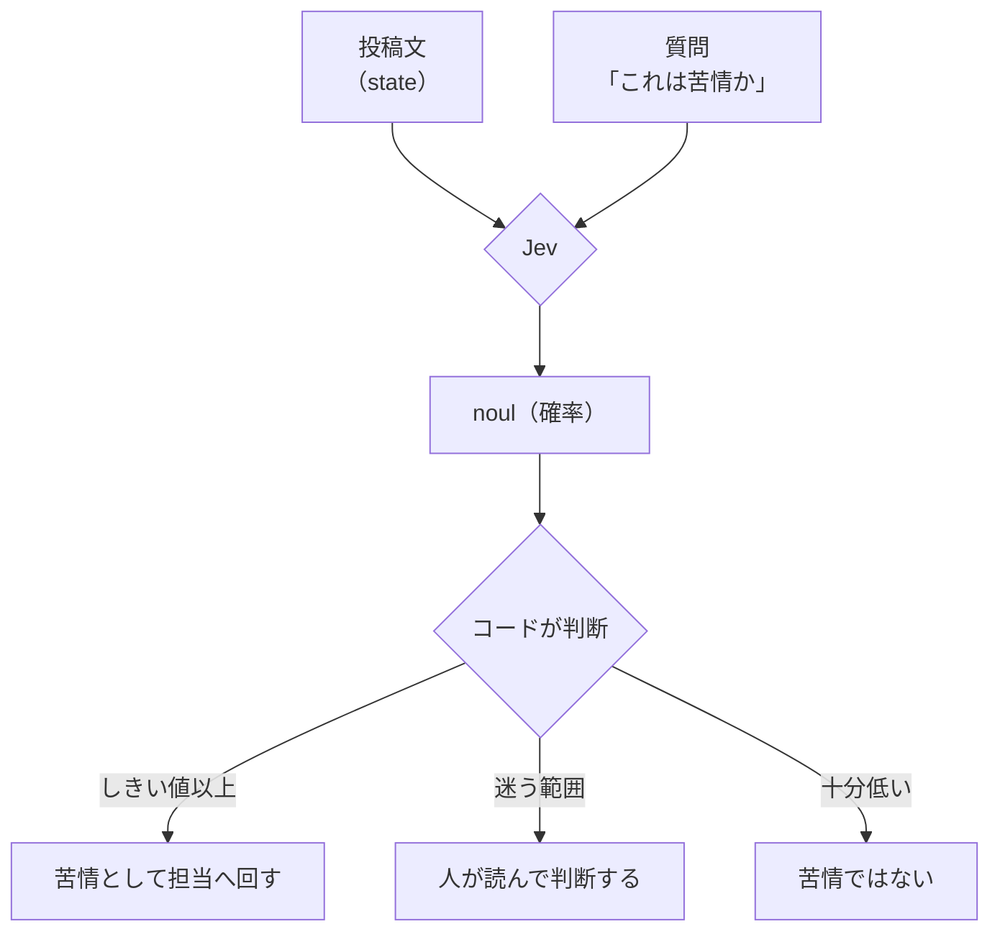

# 7級 Noul（はい/いいえ）

- 所要時間: 20分
- 先に読む公式ページ: [Primitives](https://docs.typesafe.ai/primitives) / [Noul](https://docs.typesafe.ai/primitives/noul)
- この章でできるようになること: 「これは苦情か？」を判定できる。確率が返る意味を説明できる

## 「はい」の確率が返ってくる

<!-- freshness: evergreen -->

「これは苦情？」と聞くと、Jev は「はい」か「いいえ」ではなく、**「はい」の確率**で答えます。
0.94 なら「ほぼ間違いなく苦情」、0.5 なら「どっちとも言える」です。

```ts
import { noul } from "@typesafe-ai/sdk";

export const isComplaint = noul("この投稿は、運営に対する苦情や不満ですか？", {
  true: "困っていること・不満・改善の要望が書かれている",
  false: "質問・お礼・報告など、不満ではない",
});

const result = await client.systemOne({
  state: post.text,
  questions: { isComplaint },
});

result.answers.isComplaint.noul; // 0〜1 の数値。「はい」の確率
```

- 第1引数（`instructions`）が質問文
- 第2引数（`criteria`）は省略できます。「はい」と「いいえ」がそれぞれ何を意味するかを書くと、判断の基準がはっきりします

```bash
npm run k07
```

<details><summary>もっと深く（プロ向け）</summary>

- 戻り値の型は SDK が質問の定義から推論します。`answers.isComplaint.noul` は `number`、存在しない名前を書くとコンパイルエラーになります
- 「苦情」の境目は人によってちがいます。`criteria` はその境目を言葉で固定する道具です。書き方で確率がどう動くかは二段で実験します
- 苦情かどうかを「0.61」と言われても、それが本当に 61% の確からしさなのか（キャリブレーションが取れているか）は別問題です。七段で測ります

</details>

> 一次情報: https://docs.typesafe.ai/primitives/noul

## 確率をどう使うかはコードが決める

<!-- freshness: evergreen -->

Jev は「苦情っぽさ 0.83」と教えてくれるだけです。
「0.8 以上なら担当に回す」と決めるのは、あなたのコードです。



[src/steps/k07-noul.ts](../../src/steps/k07-noul.ts) の `decide` 関数がこの分岐です。

```ts
export const ACTIONS = {
  escalate: t("苦情として担当へ回す", "Send to staff as a complaint"),
  review: t("人が読んで判断する", "A person reads it and decides"),
  none: t("苦情ではない", "Not a complaint"),
} as const;

export function decide(probability: number, threshold = AUTO_THRESHOLD): Action {
  if (probability >= threshold) return ACTIONS.escalate;
  if (probability >= 1 - threshold) return ACTIONS.review;
  return ACTIONS.none;
}
```

`decide` は Jev を呼ばない普通の関数なので、APIキーなしでテストできます（[tests/unit/decisions.test.ts](../../tests/unit/decisions.test.ts)）。

<details><summary>もっと深く（プロ向け）</summary>

- ここでのしきい値は仮の値です。**勘で決めたしきい値は、本番ではほぼ確実にずれています**。三段で3レーン（自動 / 確認 / 人間）を実装し、七段で自分のデータから決め直します
- 「迷う範囲」を人に回す設計は、誤判定のコストが高い用途で特に重要です。苦情を見落とすコストと、お礼を苦情扱いするコストは同じではありません

</details>

> 一次情報: https://docs.typesafe.ai/primitives
