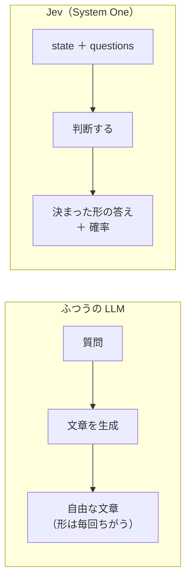

# 10級 Jevって何？

- 所要時間: 15分
- 先に読む公式ページ: [Introduction](https://docs.typesafe.ai/introduction) / [System One](https://docs.typesafe.ai/concepts/system-one)
- この章でできるようになること: LLM と Jev の違いを絵で説明できる。Playground で1回叩く

## Jev は「文章を書かないAI」

<!-- freshness: evergreen -->

ChatGPT のような AI は、質問すると**文章で**答えます。
Jev は文章を書きません。「はい か いいえ か」「A・B・C のどれか」「何点か」を、**確率つきで**答えます。
たとえるなら、作文をする生徒ではなく、マークシートを塗る生徒です。

Jev は TypeSafe AI が提供する **System One モデル**です。
入力として「判断の材料（state）」と「質問（questions）」を受け取り、決められた形（スキーマ）の答えだけを返します。



| | ふつうの LLM | Jev |
|---|---|---|
| 返すもの | 文章 | はい/いいえ・選択肢・点数（と確率） |
| 形 | 毎回ちがいうる | スキーマの外の値は返さない |
| 得意なこと | 書く、要約する、会話する | 分ける、選ぶ、点をつける |

<details><summary>もっと深く（プロ向け）</summary>

- 名前の由来はカーネマンの System 1（速い直感的な判断）と System 2（遅い熟考）。Jev は前者の「速い判断」に特化している、という位置づけ
- LLM に JSON で答えさせる方法（構造化出力）でも形はそろえられますが、確率は「文章のついでに出てくる値」になります。Jev は最初から確率分布を返すことが目的のモデルです
- **型安全 ≠ 事実の正しさ**。スキーマ外の値が返らないことと、判断が正しいことは別の話です。この区別は十段でくわしく扱います

</details>

> 一次情報: https://docs.typesafe.ai/concepts/system-one

## まず公式のデモで触り、次にこのリポジトリで同じことをする

<!-- freshness: volatile -->

まずは何もインストールせずに、ブラウザで触ってみましょう。

公式のインタラクティブなデモ（Jev Lab）で、文章と質問を入れて答えが返るのを見てみてください。
この教材ではデモを自作しません。公式のものがいちばん新しく、正確だからです。

触ったら、次はこのリポジトリのサンプルで同じことをします。

```bash
npm run demo   # APIキーなしで、記録済みの結果を再生
npm run k10    # キーを入れたあと、本物のAPIで
```

`npm run k10` は、お祭り掲示板の投稿「盆踊りは雨が降ってもやりますか？」に対して「これは質問ですか？」と聞きます（[src/steps/k10-hello.ts](../../src/steps/k10-hello.ts)）。

<details><summary>もっと深く（プロ向け）</summary>

10級のサンプルだけは、モデルに `jev-latest`（エイリアス）を使っています。初回は最新で動くほうが親切だからです。
9級以降は、教材が検証したバージョンに固定します（固定するバージョンは [facts.md](../_generated/facts.md#モデル) を参照）。
なぜ固定するのかは九段で扱います。

</details>

> 一次情報: https://docs.typesafe.ai/introduction
