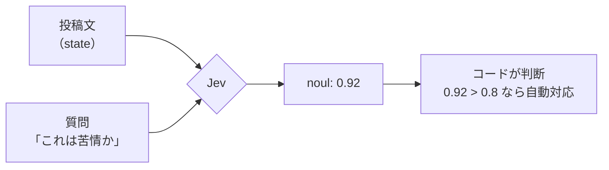

# jev-dojo — plan.md

Jev（TypeSafe AI の System One モデル）のハンズオン教材リポジトリ計画。

- 最終更新: 2026-09-24
- ステータス: 計画（未着手）

---

## 1. リポジトリ名

**第一候補: `jev-dojo`**

理由:

- 「級 → 段」の進行が、中学生レベルからプロまでという設計思想とそのまま一致する
- 既存の `awesome-jev` 系（6本以上乱立中）とキーワードが衝突しない
- 短く、英語話者にも読める。将来 `jev-dojo.dev` などのドメインが取りやすい

代替案:

| 名前 | 評価 |
|---|---|
| `jev-handson-ja` | 検索されやすいが、日本語限定と読まれて英語圏の星を捨てる |
| `learn-jev` | 汎用すぎて公式や大手に取られる可能性がある |
| `jev-by-example` | わかりやすいが、ビジュアル/段階設計という特徴が名前に出ない |
| `jev-lab` | Jev Lab（OpenRouter が紹介する公式デモ）と衝突するので不可 |

着手前に GitHub と npm で `jev-dojo` の空きを確認すること。`jev-lab` は使わない。

---

## 2. 競合調査

調査日: 2026-09-24。Jev は 2026年9月15日にアーリーアクセス公開、9月20日にウェイトリスト撤廃。発表から10日弱で以下が出揃っている。

### 2.1 一次情報（競合ではなく依存先）

| 名称 | 内容 | 扱い |
|---|---|---|
| docs.typesafe.ai | Quick start / 概念 / 3プリミティブ / Confidence / Patterns 4種 / Cookbooks 16種 / API / SDK | **正典。全章からリンクする** |
| docs.typesafe.ai/llms.txt | 全ページのURLと1行説明の機械可読インデックス | 陳腐化検出のCIに使う（§7） |
| docs.typesafe.ai/model-jaggedness/jev-1.13 | 公式が認めている弱点集 | 上級章の中核教材 |
| typesafe-ai/skills | Claude Code / Codex 用の公式エージェントスキル | 応用章で扱う |
| Jev Lab / Smart home demo | 公式インタラクティブデモ | 冒頭で誘導。自作しない |

### 2.2 英語圏の競合

| 種別 | 例 | 弱点 |
|---|---|---|
| awesome系リスト | cobanov, AnotiaWang, AbdelStark, Anil-matcha, yibie, valentynkit, v-modal | 索引であって教材ではない。学習順序がない |
| 解説記事 | flaviocopes.com, daily.dev, DataCamp, dev.to | 読み物。手を動かす導線がない |
| 単発チュートリアル | SerpApi（ファクトチェッカー）, LangChain blog（harness） | 1題材で終わり。段階設計なし |
| ニュース | The New Stack, Tom's Hardware | 教材ではない |

### 2.3 日本語圏の競合

| 記事 | 種別 | 弱点 |
|---|---|---|
| Qiita「話題のJevとは？」 | 概念解説＋アクセス経路 | ウェイトリスト前提の記述が既に陳腐化 |
| Qiita「みんなどうやって使っているのか？」 | GitHub/Xの利用実態集計 | スナップショット。手は動かない |
| Zenn caen「Jevってなんだ？」 | 技術的位置づけ（OpenJev、Logit抽出との比較） | 深いが読み物 |
| Zenn 1amageek「文字列を捨てたモデル」 | 批判的検証、ベンチ精査 | 読み物 |
| Zenn kun432 scraps | 実験ログ | 断片的 |
| note まさお | 試用レポート | 表層的 |
| gihyo | ニュース | — |
| uravation | 料金・仕様まとめ（経営者向け） | 実装なし |
| ytal.io | 本番ログで名寄せ検証、8設計を比較して不採用の結論 | **質が高い。ただし単一ユースケースの検証記事** |
| ai-native.jp | 失敗モード9項目の実装検証 | **質が高い。ただし記事1本** |

### 2.4 空いている場所

確認できた範囲で、**クローンして即実行できる日本語のJev学習リポジトリは存在しない**。加えて次が空いている。

1. **段階設計**。入門と実務の間が全部抜けている。既存はどれも「概念だけ」か「1ユースケースだけ」
2. **テスト付き**。APIキーなしでも通るテストを備えた教材がない
3. **日本語精度の再現可能な検証**。公式ドキュメントの Models ページは「英語が主要学習言語で精度が最も良い。CJKを含む他言語も扱えるが同等ではない。非英語のワークロードで頼る前に自分のコンテンツでテストせよ」と明記している。日本語記事の多くが「日本語での精度は未確認」と書いて止まっている。**ここを埋めるのが本教材の最大の差別化**
4. **陳腐化対策**。全記事が「2026年9月時点」で固まっており、ウェイトリスト撤廃で既に一部が誤情報化している

### 2.5 勝ち方（設計方針に落とす）

| 競合の弱点 | 本教材の打ち手 | 章 |
|---|---|---|
| 索引だけ | 級位制の学習順序 | 全体 |
| 読むだけ | 全章に実行コマンドとテスト | 全体 |
| 1ユースケース | 共通題材を段階的に育てる | 全体 |
| 数字が古くなる | 事実の単一ソース化＋CI検出 | §7 |
| 日本語精度が未検証 | 再現可能な日本語評価ラボ | 八段 |
| 「動いた」で終わる | キャリブレーション測定と閾値決定 | 六段〜七段 |

---

## 3. 学習設計

### 3.1 到達目標

読了後に、以下ができる状態を「プロ」と定義する。

1. ある業務判断を見て、コードに残す部分とJevに渡す部分を分割できる
2. Choice / Score / Noul のどれを使うか根拠を持って選べる
3. state に何を入れ何を入れないかを、精度とコストの両面から判断できる
4. confidence の閾値を、勘ではなく自分のデータの測定結果から決められる
5. 自分のデータでキャリブレーションを測り、Jevを採用するか見送るかを判断できる
6. レート制限、リトライ、モデルのバージョン固定、コスト監視を本番想定で設計できる
7. 「Jevは型を保証するが判断の正しさは保証しない」を、他人に実例つきで説明できる

### 3.2 二層構造（中学生 → プロ）

**全セクションを同じ3レイヤーで書く。** これが「中学生でもわかる」と「プロになれる」を両立させる唯一の方法。

```
## セクション名

### ひとことで（誰でも読める）
たとえ話と図。専門用語ゼロ。3〜5行。

### ちゃんと言うと（手を動かす）
用語の定義 → コード → 実行 → 出力 → 何が起きたか。

<details><summary>もっと深く（プロ向け）</summary>
設計上のトレードオフ、失敗例、計測結果、一次情報リンク。
</details>

> 一次情報: https://docs.typesafe.ai/...
```

`<details>` は GitHub がそのまま折りたたむので、初学者は閉じたまま進める。

### 3.3 級位・段位（章立て）

共通題材は **「地域のお祭り掲示板」**。住民が投稿する文章をさばく。中学生でも状況が想像でき、かつ実務（モデレーション、ルーティング、抽出、ランキング）に一対一で写像できる。1章ごとに機能が増え、最後は本番構成になる。

#### 入門（級）

| 章 | タイトル | 到達点 |
|---|---|---|
| 10級 | Jevって何？ | LLMとの違いを絵で説明できる。Playgroundで1回叩く |
| 9級 | 環境をつくる | `git clone` → `npm i` → `npm run check` が通る |
| 8級 | 最初の1回 | curl でPOSTし、レスポンスのJSONを読める |
| 7級 | Noul（はい/いいえ） | 「これは苦情か？」を判定。確率が返る意味を理解 |
| 6級 | Choice（選ぶ） | 投稿を担当部署に振り分ける |
| 5級 | Score（点をつける） | 緊急度を3段階で評価する |
| 4級 | まとめて聞く | 3種を1リクエストに同梱。速度とコストを実測 |

#### 中級（段）

| 章 | タイトル | 到達点 |
|---|---|---|
| 初段 | state の設計 | 何を渡し何を渡さないか。詰め込むと精度が落ちることを実験で確認 |
| 二段 | instructions と criteria | 質問の書き方で答えが変わることを実験。JSON構造を使った高度な指定 |
| 三段 | confidence | probability との違い。3レーン（自動 / 確認 / 人間）の実装 |
| 四段 | パターン4種 | fan-out、confidence-gated routing、composite scoring、intent routing |
| 五段 | コードとJevの境界 | 計算・日付比較・厳密ルールはコード。線の引き方 |

#### 上級（高段）

| 章 | タイトル | 到達点 |
|---|---|---|
| 六段 | 評価データセットを作る | 50件に人手でラベルを付ける。何が正解かを自分で定義する経験 |
| 七段 | キャリブレーションを測る | Brier score と信頼度曲線。閾値を測定で決める |
| 八段 | **日本語ラボ** | 同じ課題を日英で流し、精度差を自分の手で測る |
| 九段 | 本番運用 | レート制限、429とリトライ、バージョン固定、コスト監視、ログ設計 |
| 十段 | 限界と誤用 | jaggedness、プロンプトインジェクション、「型安全 ≠ 事実の正しさ」 |

#### 発展（任意）

| 章 | タイトル |
|---|---|
| 応用A | Next.js の API Route に組み込む |
| 応用B | LLMとの二層構成（Jevが決め、LLMが書く） |
| 応用C | フレームワーク統合（Effect / TanStack AI / LangChain など）の現在地 |
| 応用D | 公式エージェントスキルを入れてコーディングエージェントに書かせる |

---

## 4. リポジトリ構成

```
jev-dojo/
├── README.md                 # 入口。5分で最初の判定が返るまで
├── plan.md                   # これ
├── CONTRIBUTING.md
├── LICENSE                   # MIT（教材はCC BY 4.0を併記）
│
├── docs/                     # 本文
│   ├── 00-index.md
│   ├── kyu/                  # 10級〜4級
│   ├── dan/                  # 初段〜五段
│   ├── kodan/                # 六段〜十段
│   ├── advanced/             # 応用A〜D
│   ├── glossary.md           # 用語集（§6）
│   └── _generated/           # 自動生成。手で触らない（§7）
│       ├── facts.md          # 料金・レート制限・モデルID
│       ├── doc-map.md        # 公式ドキュメントのページ一覧
│       └── last-verified.md  # 各事実の最終確認日
│
├── src/
│   ├── lib/
│   │   ├── client.ts         # TypeSafeClient の薄いラッパ。モデルID固定
│   │   ├── cost.ts           # トークン数から費用を計算して表示
│   │   └── fixtures.ts       # 記録／再生の切り替え
│   ├── steps/                # 章ごとの実行可能サンプル
│   │   ├── k10-hello.ts
│   │   ├── k07-noul.ts
│   │   └── ...
│   └── app/                  # 応用Aで作る Next.js アプリ
│
├── data/
│   ├── posts.ja.json         # 掲示板の投稿サンプル（日本語 60件）
│   ├── posts.en.json         # 同一内容の英訳（八段で使う）
│   ├── labels.json           # 人手ラベル（六段で作る。正解つき）
│   └── facts.json            # 揮発する事実の単一ソース（§7）
│
├── fixtures/                 # 記録済みAPIレスポンス。APIキー無しで全テストが通る
│   └── */*.json
│
├── tests/
│   ├── unit/                 # 型・純粋関数
│   ├── contract/             # fixture再生。CIの主力
│   └── eval/                 # ライブ評価。キーがある時だけ
│
├── scripts/
│   ├── verify-facts.ts       # /v1/models を叩いて facts.json と照合
│   ├── sync-doc-map.ts       # llms.txt を取得して doc-map.md を再生成
│   ├── record.ts             # fixture の録り直し
│   └── render-charts.ts      # 実行結果から図を生成（§5）
│
├── .env.example
├── .devcontainer/            # Codespaces で即起動
└── .github/workflows/
    ├── ci.yml                # 型・lint・contractテスト（キー不要）
    ├── eval.yml              # 週次。キーあり。精度とコストを記録
    └── freshness.yml         # 週次。公式ドキュメントの差分を検出（§7）
```

---

## 5. セットアップとビジュアル

### 5.1 クローンして即開始

要件: **APIキーを取る前に、クローンした人が動くものを見られること。** ここで離脱させない。

```bash
git clone https://github.com/kenmori/jev-dojo
cd jev-dojo
npm install
npm run demo          # fixture再生。APIキー不要。すぐ結果が出る
cp .env.example .env  # ここで初めてキーを入れる
npm run k10           # 本物のAPIを叩く
```

- Node.js 20以上（`@typesafe-ai/sdk` の要件）。`.nvmrc` と `engines` で明示
- `npm run doctor` … Nodeバージョン、キーの有無、疎通、残クレジットを1画面で表示
- `.devcontainer` を置き、GitHub Codespaces でボタン1つ。ローカル環境構築で詰まる層を全部拾う
- 全サンプルに費用表示を付ける。`usage.input_tokens` から算出し「今の1回: $0.0000042」と出す。教材全体を通しても新規クレジット（$5、約1.2億トークン）を使い切らない設計にし、README に総額見積もりを書く

### 5.2 ビジュアル方針

GitHub上でそのまま見えることを最優先。外部サービスに依存しない。

| 用途 | 手段 |
|---|---|
| 概念図・フロー | Mermaid（GitHubがネイティブ描画） |
| 確率分布 | **実行結果から自動生成するSVG棒グラフ**。`scripts/render-charts.ts` が出力。数値が変わっても図が自動追従する |
| 信頼度の3レーン | Mermaid flowchart |
| LLM vs Jev の対比 | 並置した2カラム図 |
| 章の進行 | README冒頭に級位マップ |

**図に数値を焼き込まない。** 焼き込むと §7 の陳腐化対策が壊れる。数値を含む図は必ず生成物にする。

例（7級の Noul）:



---

## 6. 用語集

`docs/glossary.md` に集約し、本文の初出箇所からリンクする。各項目に「中学生向けの一文」と「正確な定義」と「一次情報URL」を持たせる。

収録語:

System One モデル / Jev / state / questions / instructions / criteria / Choice / Score / Noul / probability / confidence / calibration / RLCD / fan-out（投機的ファンアウト）/ confidence-gated routing / composite scoring / intent routing / jaggedness / alias（jev-latest, jev-preview）/ Btok・Mtok / context rot / ZDR / System 1・System 2（カーネマン）

特に区別を徹底する2組:

- **probability と confidence** … 前者は各選択肢に割り当てられた確率、後者は分布の尖り具合。フラットな分布は「どれも決め手に欠ける」を意味する
- **型安全 と 事実の正しさ** … Jevはスキーマ外の値を返さないが、意味的に誤った判断は返しうる。公式ドキュメント自身が semantic judgement error を認めている

---

## 7. 陳腐化対策

最重要要件。**「事実」を本文に直接書かない。**

### 7.1 事実の単一ソース

`data/facts.json` に、変わりうる値だけを集める。

```json
{
  "lastVerified": "2026-09-24",
  "model": { "pinned": "jev-1.13.0", "aliases": ["jev-latest", "jev-preview"] },
  "pricing": { "inputPerMtok": 0.042, "outputPerMtok": 0 },
  "rateLimits": { "tokensPerSecond": 250000, "requestsPerMinute": 1200 },
  "context": { "totalTokens": 65536, "stateePlusLongestQuestion": 32768 },
  "endpoint": "https://api.typesafe.ai/v1/systemone",
  "sdk": { "js": "@typesafe-ai/sdk", "python": "typesafe-sdk" },
  "signup": { "waitlist": false, "startingCredit": "$5" }
}
```

本文は `{{facts.pricing.inputPerMtok}}` のように参照し、ビルド時に `docs/_generated/facts.md` へ展開する。数字を直書きした箇所は lint で落とす。

なお公式は「需要が非常に大きく、レート制限は予告なく変わりうる」と明記しているため、レート制限は特に揮発性が高い扱いにする。

### 7.2 賞味期限ラベル

各セクション冒頭に1つ付ける。

| ラベル | 意味 | 例 |
|---|---|---|
| 🟢 恒久 | モデルが変わっても有効 | System Oneの考え方、confidenceの使い方、コードとの境界設計 |
| 🟡 半恒久 | 大きな変更で見直す | パターン、評価手法、テスト設計 |
| 🔴 揮発 | 常に自動生成 | 価格、レート制限、モデルID、SDKバージョン、セットアップ手順 |

**執筆時の目標配分: 恒久60% / 半恒久30% / 揮発10%。** 揮発が増えるほど教材の寿命が縮む。既存の日本語記事はほぼ全部が揮発側に寄っているので、ここで差がつく。

### 7.3 CIによる自動検出

`freshness.yml`（週次 + 手動）:

1. `https://docs.typesafe.ai/llms.txt` を取得し、前回との差分を取る
   - 新規ページ → 「新しい概念が追加された可能性」Issue を自動起票
   - 削除ページ → 該当章のリンク切れ Issue
   - 説明文の変更 → 差分を Issue 本文に貼る
2. `GET /v1/models` を叩き、`facts.json` の `model` と照合。不一致で fail
3. `jev-latest` が指すバージョンIDと pinned の差分を検出。新バージョンが出たら「八段の評価を再実行せよ」Issue
4. npm の `@typesafe-ai/sdk` 最新版と `package.json` を比較（Renovate でも可）
5. 全外部リンクの死活チェック

`eval.yml`（週次、キーあり）:

- 六段のラベル付きデータに対して精度とキャリブレーションを再測定
- 結果を `docs/_generated/eval-history.md` に追記。**モデル更新で精度がどう動いたかの時系列が残る。これ自体が他にない資産になる**

### 7.4 バージョン固定の方針

- サンプルコードは `jev-1.13.0` を明示的に指定する。`jev-latest` は使わない
- 「なぜ固定するのか」を九段で教える。エイリアスは新リリースで動くため、閾値を調整済みなら固定すべき、というのが公式の指針
- ただし10級だけは `jev-latest` を使う。初回は最新で動くほうが親切

### 7.5 README の鮮度表示

冒頭に自動更新バッジを置く。

```
最終検証: 2026-09-24 ｜ 対象モデル: jev-1.13.0 ｜ SDK: @typesafe-ai/sdk 0.6.0
公式ドキュメント差分チェック: ✅ 2026-09-24
```

---

## 8. テスト戦略

教材にテストが付いていること自体が差別化。かつ「テストの書き方」を教える教材でもある。

### 3層

| 層 | 内容 | APIキー | CI |
|---|---|---|---|
| unit | 型、費用計算、閾値ロジック、集計 | 不要 | 毎PR |
| contract | 記録済みレスポンスを再生し、パース・分岐・エラー処理を検証 | 不要 | 毎PR |
| eval | 実APIを叩き、ラベル付きデータで精度とキャリブレーションを測る | 必要 | 週次と手動 |

フレームワークは Vitest。

### 設計上のポイント

- **fixture 再生を既定にする。** クローンした人がキーなしで `npm test` を緑にできる。学習障壁とCIコストを同時に下げる
- `npm run record` で fixture を録り直せる。モデル更新時の差分が git diff で見える
- **確率は完全一致で検証しない。** 許容幅（例: ±0.05）で評価するヘルパを用意し、「確率的な出力をどうテストするか」自体を教材にする
- エラー系の fixture を必ず用意する。429、401、422、タイムアウト。公式SDKはバックオフ付きリトライを既定で行い `retry-after` を尊重するが、それを知らずに自前実装する人が多い
- eval層は「合否」ではなく「記録」。精度が落ちたら fail ではなく Issue を立てる

---

## 9. 参照リンクの方針

**全セクションの末尾に一次情報リンクを必須**とする。lint で強制する（`> 一次情報:` を含まない h2 はエラー）。

### ルール

1. リンク先は原則 `docs.typesafe.ai`。ブログや二次記事は「参考」として区別し、一次情報の代わりにしない
2. 説明を一次情報より詳しく書かない。**本教材の役割は「順序」と「手を動かす場」であって、ドキュメントの代替ではない**。この線を守ると、公式が更新されても本教材が矛盾しにくい
3. 各章冒頭に「先に読む公式ページ」を1〜3本置く
4. `docs/_generated/doc-map.md` に llms.txt 由来の全ページ一覧を自動生成し、教材のどの章がどのページに対応するかの対照表を置く

### 主要な対応表（初期案）

| 章 | 一次情報 |
|---|---|
| 10級 | `/introduction`, `/concepts/system-one` |
| 8級 | `/introduction/quickstart`, `/api` |
| 7〜5級 | `/primitives`, `/primitives/noul`, `/primitives/choice`, `/primitives/score` |
| 4級 | `/patterns/fan-out`, `/cookbooks/parallel_questions` |
| 初段 | `/concepts/state` |
| 二段 | `/primitives/advanced` |
| 三段 | `/confidence`, `/patterns/confidence-routing` |
| 四段 | `/patterns`, `/patterns/composite-scoring`, `/patterns/intent-routing` |
| 五段 | `/concepts/how-to-build-with-system-one` |
| 六〜七段 | `/introduction/machine-learning-primer`, `/cookbooks/classification_using_confidence` |
| 八段 | `/models`（言語サポートの記述）, `/model-jaggedness/jev-1.13` |
| 九段 | `/models`, `/api`, `/sdk/javascript` |
| 十段 | `/model-jaggedness/jev-1.13`, `/legal` |
| 応用D | `/agent-skill` |

---

## 10. 八段（日本語ラボ）の設計

本教材で最も価値が高く、最も真似されにくい章。独立した成果物としても発信できる。

### やること

1. `data/posts.ja.json` の60件に、日英同一内容のペアを用意する
2. 同じ質問セットを日本語state / 英語state の両方で実行
3. 人手ラベルに対する精度、confidence の分布、両者の一致率を測る
4. 差が出た事例を実際に並べて観察する（敬語、主語省略、婉曲表現、皮肉あたりが効くはず）
5. 「日本語で使うなら閾値をどうずらすか」を結論として出す

### 前提の明示

公式ドキュメントの Models ページは、英語が主要学習言語で精度が最も良く、CJKを含む他言語も扱えるが同等ではない、非英語のワークロードでは自分のコンテンツでテストすること、と書いている。**この章はその指示に文字通り従う作業である**という位置づけを明記する。

### 注意

- 60件では統計的な強い主張はできない。「傾向」までに留め、限界を明記する。ここを誇張すると教材全体の信頼が落ちる
- 「Jevは日本語に弱い」という結論を先に持たない。ytal.io の検証が示したように、悪い数字が出たときの原因は質問設計側にあることが多い。**設計を変えて再測定するプロセスまで含めて教材にする**

---

## 11. 執筆順序

公開までの最短経路を先に通し、後から厚くする。

| 段階 | 内容 | 目安 |
|---|---|---|
| P0 | リポジトリ骨格、devcontainer、facts.json、CI 3本、10級〜4級 | ここで一度公開 |
| P1 | 初段〜五段、contract テスト、図の自動生成 | |
| P2 | 六段〜十段、eval CI | |
| P3 | 八段の日本語ラボ、結果を記事化 | |
| P4 | 応用A〜D、英語版 README | |

P0 を早く出す。Jevは発表10日で解説記事が飽和しており、実装教材の空席も長くは続かない。ただし P0 の時点で §7 の仕組みを入れておくこと。後から入れると全章を書き直すことになる。

---

## 12. リスク

| リスク | 対応 |
|---|---|
| モデルが更新され内容が古くなる | §7 の自動検出。バージョン固定。eval履歴を残す |
| レート制限が変わる | 公式が「予告なく変わる」と明記済み。facts.json 経由にし、本文に直書きしない |
| 公式ドキュメントが再編されリンクが死ぬ | llms.txt 差分CI + リンク死活チェック |
| 公式が同等の教材を出す | 一次情報の代替を狙わない。「順序」「テスト」「日本語検証」に価値を寄せる |
| 読者のクレジット消費 | 全サンプルに費用表示。総額見積もりをREADMEに明記。fixture再生を既定に |
| 誇張した結論を書いてしまう | 数値は必ず再現コードとセット。n数と限界を明記 |
| 教材が長すぎて完走されない | 3レイヤー構造で初学者は折りたたみを閉じたまま進める。各章の所要時間を明記 |

---

## 13. 未決事項

- [ ] `jev-dojo` の GitHub / npm / ドメインの空き確認
- [ ] 共通題材「地域のお祭り掲示板」を確定するか、別案（フリマ出品審査、社内問い合わせ）にするか
- [ ] Python も併記するか、TypeScript 単線でいくか（工数と間口のトレードオフ）
- [ ] 日本語ラボの60件をどう作るか（自作 / 公開データセット / 生成＋人手補正）
- [ ] 教材本文のライセンス（MIT か CC BY 4.0 か）
- [ ] 英語版を出すタイミング
